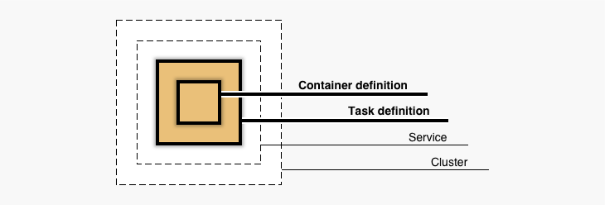
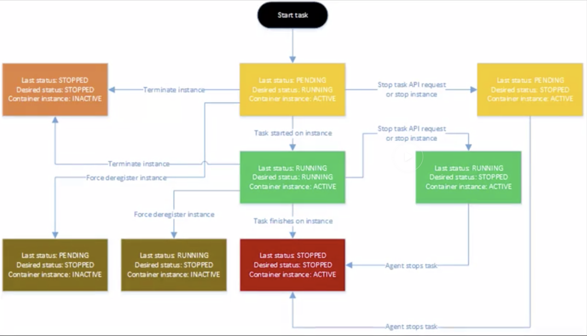

# Amazon Elastic Container Service

## ECS Clusters

To create a cluster
```bash
aws> ecs create-cluster --cluster-name deepdive
```

Here is the output
```
------------------------------------------------------------------------------------------------
|                                         CreateCluster                                        |
+----------------------------------------------------------------------------------------------+
||                                           cluster                                          ||
|+------------------------------------+-------------------------------------------------------+|
||  activeServicesCount               |  0                                                    ||
||  clusterArn                        |  arn:aws:ecs:us-east-1:289503391411:cluster/deepdive  ||
||  clusterName                       |  deepdive                                             ||
||  pendingTasksCount                 |  0                                                    ||
||  registeredContainerInstancesCount |  0                                                    ||
||  runningTasksCount                 |  0                                                    ||
||  status                            |  ACTIVE                                               ||
|+------------------------------------+-------------------------------------------------------+|
|||                                         settings                                         |||
||+--------------------------+---------------------------------------------------------------+||
|||  name                    |  containerInsights                                            |||
|||  value                   |  disabled                                                     |||
||+--------------------------+---------------------------------------------------------------+||
```

To list clusters
```bash
aws> ecs list-clusters
```

Here is the output
```
-----------------------------------------------------------
|                      ListClusters                       |
+---------------------------------------------------------+
||                      clusterArns                      ||
|+-------------------------------------------------------+|
||  arn:aws:ecs:us-east-1:289503391411:cluster/deepdive  ||
|+-------------------------------------------------------+|
```

To describe a specific cluster
```bash
aws> ecs describe-clusters --clusters deepdive
```

Here is the output
```
------------------------------------------------------------------------------------------------
|                                       DescribeClusters                                       |
+----------------------------------------------------------------------------------------------+
||                                          clusters                                          ||
|+------------------------------------+-------------------------------------------------------+|
||  activeServicesCount               |  0                                                    ||
||  clusterArn                        |  arn:aws:ecs:us-east-1:289503391411:cluster/deepdive  ||
||  clusterName                       |  deepdive                                             ||
||  pendingTasksCount                 |  0                                                    ||
||  registeredContainerInstancesCount |  0                                                    ||
||  runningTasksCount                 |  0                                                    ||
||  status                            |  ACTIVE                                               ||
|+------------------------------------+-------------------------------------------------------+|
|||                                         settings                                         |||
||+--------------------------+---------------------------------------------------------------+||
|||  name                    |  containerInsights                                            |||
|||  value                   |  disabled                                                     |||
||+--------------------------+---------------------------------------------------------------+||
```

To delete a cluster
```bash
aws> ecs delete-cluster --cluster deepdive
```

## ECS Container Agent

Here is an outline of how the AWS ECS objects relate:



A container agent is ran on an EC2 instance and it helps EC2 instance in joining a cluster. 
The container agent is open-source and can be found [here](https://github.com/aws/amazon-ecs-agent).
The agent runs on ECS optimized or custom AMIs.
On DockerHub - [here](https://hub.docker.com/r/amazon/amazon-ecs-agent/)
There are optional [configuration values](https://docs.aws.amazon.com/AmazonECS/latest/developerguide/ecs-agent-config.html). 
Status reports are available when ecs container agent is installed on the EC2 instance. 

Create s3 bucket
```bash
aws> s3api create-bucket --bucket deepu-bucket-ecs-deepdive
```

```
--------------------------------------------
|               CreateBucket               |
+-----------+------------------------------+
|  Location |  /deepu-bucket-ecs-deepdive  |
+-----------+------------------------------+
```

```bash
aws> s3 cp ecs.config s3://deepu-bucket-ecs-deepdive
upload: ./ecs.config to s3://deepu-bucket-ecs-deepdive/ecs.config
```

```bash
aws> s3 ls s3://deepu-bucket-ecs-deepdive
2019-09-03 22:17:09         21 ecs.config
```

## ECS Container Instance

A container instance is an EC2 instance registered to a cluster. 
Connects via a container agent. 
LifeCycle States
- ACTIVE and connected (registered container instance and connection status is TRUE - Container instance is UP.)
- ACTIVE and disconnected (Stopped container instance)
- INACTIVE (de-registered container instance and will not be seen as part of the cluster)

```bash
aws> ec2 run-instances --image-id ami-0b16d80945b1a9c7d --count 1 --instance-type t2.micro --iam-instance-profile Name=ecsInstanceRole --key-name ~/Documents/pem-keys/elk-stack.pem --security-group-ids sg-02909c0c9fb1ace0e --user-data file://copy-ecs-config-to-s3
```

```bash
aws> ecs list-container-instances --cluster deepdive
```

```
--------------------------------------------------------------------------------------------------
|                                     ListContainerInstances                                     |
+------------------------------------------------------------------------------------------------+
||                                     containerInstanceArns                                    ||
|+----------------------------------------------------------------------------------------------+|
||  arn:aws:ecs:us-east-1:289503391411:container-instance/6368caa4-6386-4a5b-9c60-ac752591b819  ||
|+----------------------------------------------------------------------------------------------+|
```

```bash
aws> ecs describe-container-instances --cluster deepdive --container-instances arn:aws:ecs:us-east-1:289503391411:container-instance/6368caa4-6386-4a5b-9c60-ac752591b819
```

```
----------------------------------------------------------------------------------------------------------------------------------------------------------------------------------------------------------------------------
|                                                                                                DescribeContainerInstances                                                                                                |
+--------------------------------------------------------------------------------------------------------------------------------------------------------------------------------------------------------------------------+
||                                                                                                   containerInstances                                                                                                   ||
|+----------------+----------------------------------------------------------------------------------------------+----------------------+--------------------+-----------------+--------------------+---------+-----------+|
|| agentConnected |                                    containerInstanceArn                                      |    ec2InstanceId     | pendingTasksCount  |  registeredAt   | runningTasksCount  | status  |  version  ||
|+----------------+----------------------------------------------------------------------------------------------+----------------------+--------------------+-----------------+--------------------+---------+-----------+|
||  True          |  arn:aws:ecs:us-east-1:289503391411:container-instance/6368caa4-6386-4a5b-9c60-ac752591b819  |  i-0bccc3b7f5f2fa1bf |  0                 |  1567565218.739 |  0                 |  ACTIVE |  3        ||
|+----------------+----------------------------------------------------------------------------------------------+----------------------+--------------------+-----------------+--------------------+---------+-----------+|
|||                                                                                                      attributes                                                                                                      |||
||+----------------------------------------------------------------------------------------------------------------------------------------------------------+-----------------------------------------------------------+||
|||                                                                           name                                                                           |                           value                           |||
||+----------------------------------------------------------------------------------------------------------------------------------------------------------+-----------------------------------------------------------+||
|||  ecs.capability.secrets.asm.environment-variables                                                                                                        |                                                           |||
|||  ecs.capability.branch-cni-plugin-version                                                                                                                |  cdd89b92-                                                |||
|||  ecs.ami-id                                                                                                                                              |  ami-0b16d80945b1a9c7d                                    |||
|||  ecs.capability.secrets.asm.bootstrap.log-driver                                                                                                         |                                                           |||
|||  ecs.capability.task-eia.optimized-cpu                                                                                                                   |                                                           |||
|||  com.amazonaws.ecs.capability.logging-driver.none                                                                                                        |                                                           |||
|||  ecs.capability.ecr-endpoint                                                                                                                             |                                                           |||
|||  ecs.capability.docker-plugin.local                                                                                                                      |                                                           |||
|||  ecs.capability.task-cpu-mem-limit                                                                                                                       |                                                           |||
|||  ecs.capability.secrets.ssm.bootstrap.log-driver                                                                                                         |                                                           |||
|||  com.amazonaws.ecs.capability.docker-remote-api.1.30                                                                                                     |                                                           |||
|||  com.amazonaws.ecs.capability.docker-remote-api.1.31                                                                                                     |                                                           |||
|||  com.amazonaws.ecs.capability.docker-remote-api.1.32                                                                                                     |                                                           |||
|||  ecs.availability-zone                                                                                                                                   |  us-east-1d                                               |||
|||  ecs.capability.aws-appmesh                                                                                                                              |                                                           |||
|||  com.amazonaws.ecs.capability.logging-driver.awslogs                                                                                                     |                                                           |||
|||  com.amazonaws.ecs.capability.docker-remote-api.1.24                                                                                                     |                                                           |||
|||  ecs.capability.task-eni-trunking                                                                                                                        |                                                           |||
|||  com.amazonaws.ecs.capability.docker-remote-api.1.25                                                                                                     |                                                           |||
|||  com.amazonaws.ecs.capability.docker-remote-api.1.26                                                                                                     |                                                           |||
|||  com.amazonaws.ecs.capability.docker-remote-api.1.27                                                                                                     |                                                           |||
|||  com.amazonaws.ecs.capability.docker-remote-api.1.28                                                                                                     |                                                           |||
|||  com.amazonaws.ecs.capability.privileged-container                                                                                                       |                                                           |||
|||  com.amazonaws.ecs.capability.docker-remote-api.1.29                                                                                                     |                                                           |||
|||  ecs.cpu-architecture                                                                                                                                    |  x86_64                                                   |||
|||  ecs.capability.firelens.fluentbit                                                                                                                       |                                                           |||
|||  com.amazonaws.ecs.capability.ecr-auth                                                                                                                   |                                                           |||
|||  ecs.os-type                                                                                                                                             |  linux                                                    |||
|||  com.amazonaws.ecs.capability.docker-remote-api.1.20                                                                                                     |                                                           |||
|||  com.amazonaws.ecs.capability.docker-remote-api.1.21                                                                                                     |                                                           |||
|||  com.amazonaws.ecs.capability.docker-remote-api.1.22                                                                                                     |                                                           |||
|||  ecs.capability.private-registry-authentication.secretsmanager                                                                                           |                                                           |||
|||  ecs.capability.task-eia                                                                                                                                 |                                                           |||
|||  com.amazonaws.ecs.capability.docker-remote-api.1.23                                                                                                     |                                                           |||
|||  com.amazonaws.ecs.capability.logging-driver.syslog                                                                                                      |                                                           |||
|||  com.amazonaws.ecs.capability.logging-driver.awsfirelens                                                                                                 |                                                           |||
|||  com.amazonaws.ecs.capability.logging-driver.json-file                                                                                                   |                                                           |||
|||  ecs.capability.execution-role-awslogs                                                                                                                   |                                                           |||
|||  ecs.vpc-id                                                                                                                                              |  vpc-8954fcf3                                             |||
|||  com.amazonaws.ecs.capability.docker-remote-api.1.17                                                                                                     |                                                           |||
|||  com.amazonaws.ecs.capability.docker-remote-api.1.18                                                                                                     |                                                           |||
|||  com.amazonaws.ecs.capability.docker-remote-api.1.19                                                                                                     |                                                           |||
|||  ecs.capability.task-eni                                                                                                                                 |                                                           |||
|||  ecs.capability.firelens.fluentd                                                                                                                         |                                                           |||
|||  ecs.capability.execution-role-ecr-pull                                                                                                                  |                                                           |||
|||  ecs.capability.container-health-check                                                                                                                   |                                                           |||
|||  ecs.subnet-id                                                                                                                                           |  subnet-82c45eac                                          |||
|||  ecs.instance-type                                                                                                                                       |  t2.micro                                                 |||
|||  com.amazonaws.ecs.capability.task-iam-role-network-host                                                                                                 |                                                           |||
|||  ecs.capability.container-ordering                                                                                                                       |                                                           |||
|||  ecs.capability.cni-plugin-version                                                                                                                       |  91ccefc8-2019.06.0                                       |||
|||  ecs.capability.pid-ipc-namespace-sharing                                                                                                                |                                                           |||
|||  ecs.capability.secrets.ssm.environment-variables                                                                                                        |                                                           |||
|||  com.amazonaws.ecs.capability.task-iam-role                                                                                                              |                                                           |||
||+----------------------------------------------------------------------------------------------------------------------------------------------------------+-----------------------------------------------------------+||
|||                                                                                                  registeredResources                                                                                                 |||
||+-------------------------------------------------+------------------------------------------------------+--------------------------------------------+--------------------------+-------------------------------------+||
|||                   doubleValue                   |                    integerValue                      |                 longValue                  |          name            |                type                 |||
||+-------------------------------------------------+------------------------------------------------------+--------------------------------------------+--------------------------+-------------------------------------+||
|||  0.0                                            |  1024                                                |  0                                         |  CPU                     |  INTEGER                            |||
||+-------------------------------------------------+------------------------------------------------------+--------------------------------------------+--------------------------+-------------------------------------+||
|||                                                                                                  registeredResources                                                                                                 |||
||+------------------------------------------------+----------------------------------------------------+------------------------------------------+--------------------------------+------------------------------------+||
|||                   doubleValue                  |                   integerValue                     |                longValue                 |             name               |               type                 |||
||+------------------------------------------------+----------------------------------------------------+------------------------------------------+--------------------------------+------------------------------------+||
|||  0.0                                           |  983                                               |  0                                       |  MEMORY                        |  INTEGER                           |||
||+------------------------------------------------+----------------------------------------------------+------------------------------------------+--------------------------------+------------------------------------+||
|||                                                                                                  registeredResources                                                                                                 |||
||+-----------------------------------------------+---------------------------------------------------+------------------------------------------+----------------------------+------------------------------------------+||
|||                  doubleValue                  |                   integerValue                    |                longValue                 |           name             |                  type                    |||
||+-----------------------------------------------+---------------------------------------------------+------------------------------------------+----------------------------+------------------------------------------+||
|||  0.0                                          |  0                                                |  0                                       |  PORTS                     |  STRINGSET                               |||
||+-----------------------------------------------+---------------------------------------------------+------------------------------------------+----------------------------+------------------------------------------+||
||||                                                                                                   stringSetValue                                                                                                   ||||
|||+--------------------------------------------------------------------------------------------------------------------------------------------------------------------------------------------------------------------+|||
||||  22                                                                                                                                                                                                                ||||
||||  2376                                                                                                                                                                                                              ||||
||||  2375                                                                                                                                                                                                              ||||
||||  51678                                                                                                                                                                                                             ||||
||||  51679                                                                                                                                                                                                             ||||
|||+--------------------------------------------------------------------------------------------------------------------------------------------------------------------------------------------------------------------+|||
|||                                                                                                  registeredResources                                                                                                 |||
||+--------------------------------------------+------------------------------------------------+---------------------------------------+---------------------------------------+----------------------------------------+||
|||                 doubleValue                |                 integerValue                   |               longValue               |                 name                  |                 type                   |||
||+--------------------------------------------+------------------------------------------------+---------------------------------------+---------------------------------------+----------------------------------------+||
|||  0.0                                       |  0                                             |  0                                    |  PORTS_UDP                            |  STRINGSET                             |||
||+--------------------------------------------+------------------------------------------------+---------------------------------------+---------------------------------------+----------------------------------------+||
|||                                                                                                  remainingResources                                                                                                  |||
||+-------------------------------------------------+------------------------------------------------------+--------------------------------------------+--------------------------+-------------------------------------+||
|||                   doubleValue                   |                    integerValue                      |                 longValue                  |          name            |                type                 |||
||+-------------------------------------------------+------------------------------------------------------+--------------------------------------------+--------------------------+-------------------------------------+||
|||  0.0                                            |  1024                                                |  0                                         |  CPU                     |  INTEGER                            |||
||+-------------------------------------------------+------------------------------------------------------+--------------------------------------------+--------------------------+-------------------------------------+||
|||                                                                                                  remainingResources                                                                                                  |||
||+------------------------------------------------+----------------------------------------------------+------------------------------------------+--------------------------------+------------------------------------+||
|||                   doubleValue                  |                   integerValue                     |                longValue                 |             name               |               type                 |||
||+------------------------------------------------+----------------------------------------------------+------------------------------------------+--------------------------------+------------------------------------+||
|||  0.0                                           |  983                                               |  0                                       |  MEMORY                        |  INTEGER                           |||
||+------------------------------------------------+----------------------------------------------------+------------------------------------------+--------------------------------+------------------------------------+||
|||                                                                                                  remainingResources                                                                                                  |||
||+-----------------------------------------------+---------------------------------------------------+------------------------------------------+----------------------------+------------------------------------------+||
|||                  doubleValue                  |                   integerValue                    |                longValue                 |           name             |                  type                    |||
||+-----------------------------------------------+---------------------------------------------------+------------------------------------------+----------------------------+------------------------------------------+||
|||  0.0                                          |  0                                                |  0                                       |  PORTS                     |  STRINGSET                               |||
||+-----------------------------------------------+---------------------------------------------------+------------------------------------------+----------------------------+------------------------------------------+||
||||                                                                                                   stringSetValue                                                                                                   ||||
|||+--------------------------------------------------------------------------------------------------------------------------------------------------------------------------------------------------------------------+|||
||||  22                                                                                                                                                                                                                ||||
||||  2376                                                                                                                                                                                                              ||||
||||  2375                                                                                                                                                                                                              ||||
||||  51678                                                                                                                                                                                                             ||||
||||  51679                                                                                                                                                                                                             ||||
|||+--------------------------------------------------------------------------------------------------------------------------------------------------------------------------------------------------------------------+|||
|||                                                                                                  remainingResources                                                                                                  |||
||+--------------------------------------------+------------------------------------------------+---------------------------------------+---------------------------------------+----------------------------------------+||
|||                 doubleValue                |                 integerValue                   |               longValue               |                 name                  |                 type                   |||
||+--------------------------------------------+------------------------------------------------+---------------------------------------+---------------------------------------+----------------------------------------+||
|||  0.0                                       |  0                                             |  0                                    |  PORTS_UDP                            |  STRINGSET                             |||
||+--------------------------------------------+------------------------------------------------+---------------------------------------+---------------------------------------+----------------------------------------+||
|||                                                                                                      versionInfo                                                                                                     |||
||+----------------------------------------------+-----------------------------------------------------------+-----------------------------------------------------------------------------------------------------------+||
|||                   agentHash                  |                       agentVersion                        |                                               dockerVersion                                               |||
||+----------------------------------------------+-----------------------------------------------------------+-----------------------------------------------------------------------------------------------------------+||
|||  02ff320c                                    |  1.30.0                                                   |  DockerVersion: 18.06.1-ce                                                                                |||
||+----------------------------------------------+-----------------------------------------------------------+-----------------------------------------------------------------------------------------------------------+||
```

## ECS Tasks & Services

A `Task Definition` is a collection of 1 or more container configurations. Some Tasks may need only one container, while other Tasks may need 2 or more potentially linked containers running concurrently. The Task definition allows you to specify which Docker image to use, which ports to expose, how much CPU and memory to allot, how to collect logs, and define environment variables.

A `Task` is created when you run a Task directly, which launches container(s) (defined in the task definition) until they are stopped or exit on their own, at which point they are not replaced automatically. Running Tasks directly is ideal for short running jobs, perhaps as an example things that were accomplished via CRON.

A `Service` is used to guarantee that you always have some number of Tasks running at all times. If a Task's container exits due to error, or the underlying EC2 instance fails and is replaced, the ECS Service will replace the failed Task. This is why we create Clusters so that the Service has plenty of resources in terms of CPU, Memory and Network ports to use. To us it doesn't really matter which instance Tasks run on so long as they run. A Service configuration references a Task definition. A Service is responsible for creating Tasks.

Services are typically used for long running applications like web servers. For example, if I deployed my website powered by Node.JS in Oregon (us-west-2) I would want say at least three Tasks running across the three Availability Zones (AZ) for the sake of High-Availability; if one fails I have another two and the failed one will be replaced (read that as self-healing!). Creating a Service is the way to do this. If I had 6 EC2 instances in my cluster, 2 per AZ, the Service will automatically balance Tasks across zones as best it can while also considering cpu, memory, and network resources.

Another very important point is that a **Service can be configured to use a load balancer**, so that as it creates the Tasks—that is it launches containers defined in the Task Defintion—the Service will automatically register the container's EC2 instance with the load balancer. Tasks cannot be configured to use a load balancer, only Services can.


## ECS Scheduler

- 3 ways to schedule a task on your cluster
- The scheduler helps you utilize your resources with least effort on the user's part and in the best way possible. 
- Scheduler is flexible and we can use the instance as well if needed and we can even use third-party scheduler. 

**Services**

- Services are long lived and stateless (like a Web application)
- Define how many service instances you want (like Autoscaling, it will sclae up whenever any instance is down.)
- Works with Elastic Load Balancing as well (Hook up the service to ELB)

**3 steps for placing a service into your cluster**

- Compare the task definition's attributes to the state of the cluster and then check if the container instance can run the required attributes (cpu, memory, etc.)
- The scheduler has a list of container instances and check how many service instances are running in an availability zone. Keeping this in mind, it will place a new instance in an availability zone that has least amount of tasks running on it
- Check how many service instances are running on container instances and place a new task on the container instance that has least amount of tasks running on it. 

**Running Tasks**

- Tasks that are short lived or 1 off tasks that exit when done can be run with Scheduler. (Video encoding or DB migration for example)
- We can use `RunTask` which *randomly* distributes tasks on your cluster. But, it minimizes specific instances from getting overloaded. 

**Starting Tasks**

- Running tasks and starting tasks are different
- `StartTask` lets you *pick* where you want to run a task
- StartTasks lets you build or use your own scheduler

Services and tasks have 3 states:
- PENDING
- RUNNING
- STOPPED

The container agent is responsible for state tracking

**Task LifeCycle**



```bash
aws> ecs create-service --cluster deepdive --service-name web --task-definition web  --desired-count 1
----------------------------------------------------------------------------------------
|                                     CreateService                                    |
+--------------------------------------------------------------------------------------+
||                                       service                                      ||
|+-----------------------+------------------------------------------------------------+|
||  clusterArn           |  arn:aws:ecs:us-east-1:289503391411:cluster/deepdive       ||
||  createdAt            |  1567608636.767                                            ||
||  desiredCount         |  1                                                         ||
||  enableECSManagedTags |  False                                                     ||
||  launchType           |  EC2                                                       ||
||  pendingCount         |  0                                                         ||
||  propagateTags        |  NONE                                                      ||
||  runningCount         |  0                                                         ||
||  schedulingStrategy   |  REPLICA                                                   ||
||  serviceArn           |  arn:aws:ecs:us-east-1:289503391411:service/web            ||
||  serviceName          |  web                                                       ||
||  status               |  ACTIVE                                                    ||
||  taskDefinition       |  arn:aws:ecs:us-east-1:289503391411:task-definition/web:4  ||
|+-----------------------+------------------------------------------------------------+|
|||                              deploymentConfiguration                             |||
||+----------------------------------------------------------------+-----------------+||
|||  maximumPercent                                                |  200            |||
|||  minimumHealthyPercent                                         |  100            |||
||+----------------------------------------------------------------+-----------------+||
|||                                    deployments                                   |||
||+-----------------+----------------------------------------------------------------+||
|||  createdAt      |  1567608636.767                                                |||
|||  desiredCount   |  1                                                             |||
|||  id             |  ecs-svc/9223370469246139040                                   |||
|||  launchType     |  EC2                                                           |||
|||  pendingCount   |  0                                                             |||
|||  runningCount   |  0                                                             |||
|||  status         |  PRIMARY                                                       |||
|||  taskDefinition |  arn:aws:ecs:us-east-1:289503391411:task-definition/web:4      |||
|||  updatedAt      |  1567608636.767                                                |||
||+-----------------+----------------------------------------------------------------+||
```

```bash
aws> ecs list-services --cluster deepdive
------------------------------------------------------
|                    ListServices                    |
+----------------------------------------------------+
||                    serviceArns                   ||
|+--------------------------------------------------+|
||  arn:aws:ecs:us-east-1:289503391411:service/web  ||
|+--------------------------------------------------+|
```


```bash
aws> ecs describe-services --cluster deepdive --services web
---------------------------------------------------------------------------------------------------------------------------------------------------
|                                                                DescribeServices                                                                 |
+-------------------------------------------------------------------------------------------------------------------------------------------------+
||                                                                   services                                                                    ||
|+---------------------------------------+-------------------------------------------------------------------------------------------------------+|
||  clusterArn                           |  arn:aws:ecs:us-east-1:289503391411:cluster/deepdive                                                  ||
||  createdAt                            |  1567608636.767                                                                                       ||
||  desiredCount                         |  1                                                                                                    ||
||  enableECSManagedTags                 |  False                                                                                                ||
||  launchType                           |  EC2                                                                                                  ||
||  pendingCount                         |  0                                                                                                    ||
||  propagateTags                        |  NONE                                                                                                 ||
||  runningCount                         |  1                                                                                                    ||
||  schedulingStrategy                   |  REPLICA                                                                                              ||
||  serviceArn                           |  arn:aws:ecs:us-east-1:289503391411:service/web                                                       ||
||  serviceName                          |  web                                                                                                  ||
||  status                               |  ACTIVE                                                                                               ||
||  taskDefinition                       |  arn:aws:ecs:us-east-1:289503391411:task-definition/web:4                                             ||
|+---------------------------------------+-------------------------------------------------------------------------------------------------------+|
|||                                                           deploymentConfiguration                                                           |||
||+--------------------------------------------------------------------------------------------------------------+------------------------------+||
|||  maximumPercent                                                                                              |  200                         |||
|||  minimumHealthyPercent                                                                                       |  100                         |||
||+--------------------------------------------------------------------------------------------------------------+------------------------------+||
|||                                                                 deployments                                                                 |||
||+-------------------------------+-------------------------------------------------------------------------------------------------------------+||
|||  createdAt                    |  1567608636.767                                                                                             |||
|||  desiredCount                 |  1                                                                                                          |||
|||  id                           |  ecs-svc/9223370469246139040                                                                                |||
|||  launchType                   |  EC2                                                                                                        |||
|||  pendingCount                 |  0                                                                                                          |||
|||  runningCount                 |  1                                                                                                          |||
|||  status                       |  PRIMARY                                                                                                    |||
|||  taskDefinition               |  arn:aws:ecs:us-east-1:289503391411:task-definition/web:4                                                   |||
|||  updatedAt                    |  1567608650.671                                                                                             |||
||+-------------------------------+-------------------------------------------------------------------------------------------------------------+||
|||                                                                   events                                                                    |||
||+----------------+----------------------------------------+-----------------------------------------------------------------------------------+||
|||    createdAt   |                  id                    |                                      message                                      |||
||+----------------+----------------------------------------+-----------------------------------------------------------------------------------+||
|||  1567608650.678|  8db7eb66-89f8-4bd0-bb9d-1a3c5f7b1d41  |  (service web) has reached a steady state.                                        |||
|||  1567608640.905|  20d60fcb-e5af-41dc-a37c-b692a68c9618  |  (service web) has started 1 tasks: (task 6b939534-e746-4375-ab3e-6c12e17b55d9).  |||
||+----------------+----------------------------------------+-----------------------------------------------------------------------------------+||
```


```bash
aws> ecs update-service --cluster deepdive --service web --task-definition web --desired-count 2
--------------------------------------------------------------------------------------------------------------------------------------------------------------------------------------------------------------
|                                                                                                UpdateService                                                                                               |
+------------------------------------------------------------------------------------------------------------------------------------------------------------------------------------------------------------+
||                                                                                                  service                                                                                                 ||
|+--------------------------------------------------------+-------------------------------------------------------------------------------------------------------------------------------------------------+|
||  clusterArn                                            |  arn:aws:ecs:us-east-1:289503391411:cluster/deepdive                                                                                            ||
||  createdAt                                             |  1567608636.767                                                                                                                                 ||
||  desiredCount                                          |  2                                                                                                                                              ||
||  enableECSManagedTags                                  |  False                                                                                                                                          ||
||  launchType                                            |  EC2                                                                                                                                            ||
||  pendingCount                                          |  0                                                                                                                                              ||
||  propagateTags                                         |  NONE                                                                                                                                           ||
||  runningCount                                          |  1                                                                                                                                              ||
||  schedulingStrategy                                    |  REPLICA                                                                                                                                        ||
||  serviceArn                                            |  arn:aws:ecs:us-east-1:289503391411:service/web                                                                                                 ||
||  serviceName                                           |  web                                                                                                                                            ||
||  status                                                |  ACTIVE                                                                                                                                         ||
||  taskDefinition                                        |  arn:aws:ecs:us-east-1:289503391411:task-definition/web:5                                                                                       ||
|+--------------------------------------------------------+-------------------------------------------------------------------------------------------------------------------------------------------------+|
|||                                                                                         deploymentConfiguration                                                                                        |||
||+------------------------------------------------------------------------------------------------------------------------------------------------------------+-------------------------------------------+||
|||  maximumPercent                                                                                                                                            |  200                                      |||
|||  minimumHealthyPercent                                                                                                                                     |  100                                      |||
||+------------------------------------------------------------------------------------------------------------------------------------------------------------+-------------------------------------------+||
|||                                                                                               deployments                                                                                              |||
||+----------------+---------------+------------------------------+-------------+---------------+---------------+----------+------------------------------------------------------------+------------------+||
|||    createdAt   | desiredCount  |             id               | launchType  | pendingCount  | runningCount  | status   |                      taskDefinition                        |    updatedAt     |||
||+----------------+---------------+------------------------------+-------------+---------------+---------------+----------+------------------------------------------------------------+------------------+||
|||  1567610184.168|  2            |  ecs-svc/9223370469244591639 |  EC2        |  0            |  0            |  PRIMARY |  arn:aws:ecs:us-east-1:289503391411:task-definition/web:5  |  1567610184.168  |||
|||  1567608636.767|  1            |  ecs-svc/9223370469246139040 |  EC2        |  0            |  1            |  ACTIVE  |  arn:aws:ecs:us-east-1:289503391411:task-definition/web:4  |  1567608650.671  |||
||+----------------+---------------+------------------------------+-------------+---------------+---------------+----------+------------------------------------------------------------+------------------+||
|||                                                                                                 events                                                                                                 |||
||+------------------------+--------------------------------------------------------+----------------------------------------------------------------------------------------------------------------------+||
|||        createdAt       |                          id                            |                                                       message                                                        |||
||+------------------------+--------------------------------------------------------+----------------------------------------------------------------------------------------------------------------------+||
|||  1567608650.678        |  8db7eb66-89f8-4bd0-bb9d-1a3c5f7b1d41                  |  (service web) has reached a steady state.                                                                           |||
|||  1567608640.905        |  20d60fcb-e5af-41dc-a37c-b692a68c9618                  |  (service web) has started 1 tasks: (task 6b939534-e746-4375-ab3e-6c12e17b55d9).                                     |||
||+------------------------+--------------------------------------------------------+----------------------------------------------------------------------------------------------------------------------+||
```


To stop the service

```bash
aws> ecs update-service --cluster deepdive --service web --task-definition web --desired-count 0
----------------------------------------------------------------------------------------------------------------------------------------------------------------------------------------------------------------------------------------------------------------------------------------------------------------------------------------------------------------------------------------------
|                                                                                                                                                                                        UpdateService                                                                                                                                                                                       |
+--------------------------------------------------------------------------------------------------------------------------------------------------------------------------------------------------------------------------------------------------------------------------------------------------------------------------------------------------------------------------------------------+
||                                                                                                                                                                                          service                                                                                                                                                                                         ||
|+-----------------------------------------------------------------------------------------------------------+------------------------------------------------------------------------------------------------------------------------------------------------------------------------------------------------------------------------------------------------------------------------------+|
||  clusterArn                                                                                               |  arn:aws:ecs:us-east-1:289503391411:cluster/deepdive                                                                                                                                                                                                                         ||
||  createdAt                                                                                                |  1567608636.767                                                                                                                                                                                                                                                              ||
||  desiredCount                                                                                             |  0                                                                                                                                                                                                                                                                           ||
||  enableECSManagedTags                                                                                     |  False                                                                                                                                                                                                                                                                       ||
||  launchType                                                                                               |  EC2                                                                                                                                                                                                                                                                         ||
||  pendingCount                                                                                             |  0                                                                                                                                                                                                                                                                           ||
||  propagateTags                                                                                            |  NONE                                                                                                                                                                                                                                                                        ||
||  runningCount                                                                                             |  1                                                                                                                                                                                                                                                                           ||
||  schedulingStrategy                                                                                       |  REPLICA                                                                                                                                                                                                                                                                     ||
||  serviceArn                                                                                               |  arn:aws:ecs:us-east-1:289503391411:service/web                                                                                                                                                                                                                              ||
||  serviceName                                                                                              |  web                                                                                                                                                                                                                                                                         ||
||  status                                                                                                   |  ACTIVE                                                                                                                                                                                                                                                                      ||
||  taskDefinition                                                                                           |  arn:aws:ecs:us-east-1:289503391411:task-definition/web:5                                                                                                                                                                                                                    ||
|+-----------------------------------------------------------------------------------------------------------+------------------------------------------------------------------------------------------------------------------------------------------------------------------------------------------------------------------------------------------------------------------------------+|
|||                                                                                                                                                                                 deploymentConfiguration                                                                                                                                                                                |||
||+-----------------------------------------------------------------------------------------------------------------------------------------------------------------------------------------------------------------------------------------------------------------------------------------------------+----------------------------------------------------------------------------------+||
|||  maximumPercent                                                                                                                                                                                                                                                                                     |  200                                                                             |||
|||  minimumHealthyPercent                                                                                                                                                                                                                                                                              |  100                                                                             |||
||+-----------------------------------------------------------------------------------------------------------------------------------------------------------------------------------------------------------------------------------------------------------------------------------------------------+----------------------------------------------------------------------------------+||
|||                                                                                                                                                                                       deployments                                                                                                                                                                                      |||
||+--------------------------------+-----------------------------+----------------------------------------------------------+-------------------------+-----------------------------+-----------------------------+--------------------+----------------------------------------------------------------------------------------------------------------+----------------------------------+||
|||            createdAt           |        desiredCount         |                           id                             |       launchType        |        pendingCount         |        runningCount         |      status        |                                                taskDefinition                                                  |            updatedAt             |||
||+--------------------------------+-----------------------------+----------------------------------------------------------+-------------------------+-----------------------------+-----------------------------+--------------------+----------------------------------------------------------------------------------------------------------------+----------------------------------+||
|||  1567610184.168                |  0                          |  ecs-svc/9223370469244591639                             |  EC2                    |  0                          |  0                          |  PRIMARY           |  arn:aws:ecs:us-east-1:289503391411:task-definition/web:5                                                      |  1567610184.168                  |||
|||  1567608636.767                |  1                          |  ecs-svc/9223370469246139040                             |  EC2                    |  0                          |  1                          |  ACTIVE            |  arn:aws:ecs:us-east-1:289503391411:task-definition/web:4                                                      |  1567610184.168                  |||
||+--------------------------------+-----------------------------+----------------------------------------------------------+-------------------------+-----------------------------+-----------------------------+--------------------+----------------------------------------------------------------------------------------------------------------+----------------------------------+||
|||                                                                                                                                                                                         events                                                                                                                                                                                         |||
||+----------------+---------------------------------------+-------------------------------------------------------------------------------------------------------------------------------------------------------------------------------------------------------------------------------------------------------------------------------------------------------------------------------+||
|||    createdAt   |                  id                   |                                                                                                                                                            message                                                                                                                                                            |||
||+----------------+---------------------------------------+-------------------------------------------------------------------------------------------------------------------------------------------------------------------------------------------------------------------------------------------------------------------------------------------------------------------------------+||
|||  1567610200.241|  edbdedf6-951a-4a93-aa62-358e9af36e4a |  (service web) was unable to place a task because no container instance met all of its requirements. The closest matching (container-instance 6368caa4-6386-4a5b-9c60-ac752591b819) is already using a port required by your task. For more information, see the Troubleshooting section of the Amazon ECS Developer Guide.   |||
|||  1567608650.678|  8db7eb66-89f8-4bd0-bb9d-1a3c5f7b1d41 |  (service web) has reached a steady state.                                                                                                                                                                                                                                                                                    |||
|||  1567608640.905|  20d60fcb-e5af-41dc-a37c-b692a68c9618 |  (service web) has started 1 tasks: (task 6b939534-e746-4375-ab3e-6c12e17b55d9).                                                                                                                                                                                                                                              |||
||+----------------+---------------------------------------+-------------------------------------------------------------------------------------------------------------------------------------------------------------------------------------------------------------------------------------------------------------------------------------------------------------------------------+||
```

```bash
aws> ecs delete-service --cluster deepdive --service web
----------------------------------------------------------------------------------------------------------------------------------------------------------------------------------------------------------------------------------------------------------------------------------------------------------------------------------------------------------------------------------------------
|                                                                                                                                                                                        DeleteService                                                                                                                                                                                       |
+--------------------------------------------------------------------------------------------------------------------------------------------------------------------------------------------------------------------------------------------------------------------------------------------------------------------------------------------------------------------------------------------+
||                                                                                                                                                                                          service                                                                                                                                                                                         ||
|+-----------------------------------------------------------------------------------------------------------+------------------------------------------------------------------------------------------------------------------------------------------------------------------------------------------------------------------------------------------------------------------------------+|
||  clusterArn                                                                                               |  arn:aws:ecs:us-east-1:289503391411:cluster/deepdive                                                                                                                                                                                                                         ||
||  createdAt                                                                                                |  1567608636.767                                                                                                                                                                                                                                                              ||
||  desiredCount                                                                                             |  0                                                                                                                                                                                                                                                                           ||
||  enableECSManagedTags                                                                                     |  False                                                                                                                                                                                                                                                                       ||
||  launchType                                                                                               |  EC2                                                                                                                                                                                                                                                                         ||
||  pendingCount                                                                                             |  0                                                                                                                                                                                                                                                                           ||
||  propagateTags                                                                                            |  NONE                                                                                                                                                                                                                                                                        ||
||  runningCount                                                                                             |  0                                                                                                                                                                                                                                                                           ||
||  schedulingStrategy                                                                                       |  REPLICA                                                                                                                                                                                                                                                                     ||
||  serviceArn                                                                                               |  arn:aws:ecs:us-east-1:289503391411:service/web                                                                                                                                                                                                                              ||
||  serviceName                                                                                              |  web                                                                                                                                                                                                                                                                         ||
||  status                                                                                                   |  DRAINING                                                                                                                                                                                                                                                                    ||
||  taskDefinition                                                                                           |  arn:aws:ecs:us-east-1:289503391411:task-definition/web:5                                                                                                                                                                                                                    ||
|+-----------------------------------------------------------------------------------------------------------+------------------------------------------------------------------------------------------------------------------------------------------------------------------------------------------------------------------------------------------------------------------------------+|
|||                                                                                                                                                                                 deploymentConfiguration                                                                                                                                                                                |||
||+-----------------------------------------------------------------------------------------------------------------------------------------------------------------------------------------------------------------------------------------------------------------------------------------------------+----------------------------------------------------------------------------------+||
|||  maximumPercent                                                                                                                                                                                                                                                                                     |  200                                                                             |||
|||  minimumHealthyPercent                                                                                                                                                                                                                                                                              |  100                                                                             |||
||+-----------------------------------------------------------------------------------------------------------------------------------------------------------------------------------------------------------------------------------------------------------------------------------------------------+----------------------------------------------------------------------------------+||
|||                                                                                                                                                                                       deployments                                                                                                                                                                                      |||
||+--------------------------------+-----------------------------+----------------------------------------------------------+-------------------------+-----------------------------+-----------------------------+--------------------+----------------------------------------------------------------------------------------------------------------+----------------------------------+||
|||            createdAt           |        desiredCount         |                           id                             |       launchType        |        pendingCount         |        runningCount         |      status        |                                                taskDefinition                                                  |            updatedAt             |||
||+--------------------------------+-----------------------------+----------------------------------------------------------+-------------------------+-----------------------------+-----------------------------+--------------------+----------------------------------------------------------------------------------------------------------------+----------------------------------+||
|||  1567610184.168                |  0                          |  ecs-svc/9223370469244591639                             |  EC2                    |  0                          |  0                          |  PRIMARY           |  arn:aws:ecs:us-east-1:289503391411:task-definition/web:5                                                      |  1567610345.337                  |||
|||  1567608636.767                |  1                          |  ecs-svc/9223370469246139040                             |  EC2                    |  0                          |  0                          |  ACTIVE            |  arn:aws:ecs:us-east-1:289503391411:task-definition/web:4                                                      |  1567610184.168                  |||
||+--------------------------------+-----------------------------+----------------------------------------------------------+-------------------------+-----------------------------+-----------------------------+--------------------+----------------------------------------------------------------------------------------------------------------+----------------------------------+||
|||                                                                                                                                                                                         events                                                                                                                                                                                         |||
||+----------------+---------------------------------------+-------------------------------------------------------------------------------------------------------------------------------------------------------------------------------------------------------------------------------------------------------------------------------------------------------------------------------+||
|||    createdAt   |                  id                   |                                                                                                                                                            message                                                                                                                                                            |||
||+----------------+---------------------------------------+-------------------------------------------------------------------------------------------------------------------------------------------------------------------------------------------------------------------------------------------------------------------------------------------------------------------------------+||
|||  1567610345.38 |  affb2376-1662-48db-9289-97c56c373cc7 |  (service web) has stopped 1 running tasks: (task 6b939534-e746-4375-ab3e-6c12e17b55d9).                                                                                                                                                                                                                                      |||
|||  1567610200.241|  edbdedf6-951a-4a93-aa62-358e9af36e4a |  (service web) was unable to place a task because no container instance met all of its requirements. The closest matching (container-instance 6368caa4-6386-4a5b-9c60-ac752591b819) is already using a port required by your task. For more information, see the Troubleshooting section of the Amazon ECS Developer Guide.   |||
|||  1567608650.678|  8db7eb66-89f8-4bd0-bb9d-1a3c5f7b1d41 |  (service web) has reached a steady state.                                                                                                                                                                                                                                                                                    |||
|||  1567608640.905|  20d60fcb-e5af-41dc-a37c-b692a68c9618 |  (service web) has started 1 tasks: (task 6b939534-e746-4375-ab3e-6c12e17b55d9).                                                                                                                                                                                                                                              |||
||+----------------+---------------------------------------+-------------------------------------------------------------------------------------------------------------------------------------------------------------------------------------------------------------------------------------------------------------------------------------------------------------------------------+||
```


## ECS Task Definitions

[Task Definitions](https://docs.aws.amazon.com/AmazonECS/latest/developerguide/task_definitions.html) describe how Docker images should be ran. 

Each Task Definition can control 1 or more containers (with optional volumes)

Applications can be 1 or more task definitions. 

Grouped containers run on the same instance. This can be used for minimum latency. 

Services are created through task definitions.

Components of Task definition.
- Family -> Used for versioning the Task Definition when it is modified.
- [Container definition](https://docs.aws.amazon.com/AmazonECS/latest/developerguide/task_definition_parameters.html)
- Volumes -> A way to share data between containers. 

```bash
aws> ecs register-task-definition --cli-input-json file://web-task-definition.json
```

```
------------------------------------------------------------------------------------------------
|                                    RegisterTaskDefinition                                    |
+----------------------------------------------------------------------------------------------+
||                                       taskDefinition                                       ||
|+--------+-----------+---------+-------------------------------------------------------------+|
|| family | revision  | status  |                      taskDefinitionArn                      ||
|+--------+-----------+---------+-------------------------------------------------------------+|
||  web   |  1        |  ACTIVE |  arn:aws:ecs:us-east-1:289503391411:task-definition/web:1   ||
|+--------+-----------+---------+-------------------------------------------------------------+|
|||                                      compatibilities                                     |||
||+------------------------------------------------------------------------------------------+||
|||  EC2                                                                                     |||
||+------------------------------------------------------------------------------------------+||
|||                                   containerDefinitions                                   |||
||+-----------+------------------------+----------------+------------------+-----------------+||
|||    cpu    |       essential        |     image      |     memory       |      name       |||
||+-----------+------------------------+----------------+------------------+-----------------+||
|||  102      |  True                  |  nginx         |  50              |  nginx          |||
||+-----------+------------------------+----------------+------------------+-----------------+||
||||                                      portMappings                                      ||||
|||+-----------------------------------+-------------------------+--------------------------+|||
||||           containerPort           |        hostPort         |        protocol          ||||
|||+-----------------------------------+-------------------------+--------------------------+|||
||||  80                               |  80                     |  tcp                     ||||
|||+-----------------------------------+-------------------------+--------------------------+|||
```

```bash
aws> ecs list-task-definition-families
----------------------------
|ListTaskDefinitionFamilies|
+--------------------------+
||        families        ||
|+------------------------+|
||  web                   ||
|+------------------------+|
```

```bash
aws> ecs list-task-definitions
----------------------------------------------------------------
|                      ListTaskDefinitions                     |
+--------------------------------------------------------------+
||                     taskDefinitionArns                     ||
|+------------------------------------------------------------+|
||  arn:aws:ecs:us-east-1:289503391411:task-definition/web:1  ||
|+------------------------------------------------------------+|
```

```bash
aws> ecs describe-task-definition --task-definition web:1
------------------------------------------------------------------------------------------------
|                                    DescribeTaskDefinition                                    |
+----------------------------------------------------------------------------------------------+
||                                       taskDefinition                                       ||
|+--------+-----------+---------+-------------------------------------------------------------+|
|| family | revision  | status  |                      taskDefinitionArn                      ||
|+--------+-----------+---------+-------------------------------------------------------------+|
||  web   |  1        |  ACTIVE |  arn:aws:ecs:us-east-1:289503391411:task-definition/web:1   ||
|+--------+-----------+---------+-------------------------------------------------------------+|
|||                                      compatibilities                                     |||
||+------------------------------------------------------------------------------------------+||
|||  EC2                                                                                     |||
||+------------------------------------------------------------------------------------------+||
|||                                   containerDefinitions                                   |||
||+-----------+------------------------+----------------+------------------+-----------------+||
|||    cpu    |       essential        |     image      |     memory       |      name       |||
||+-----------+------------------------+----------------+------------------+-----------------+||
|||  102      |  True                  |  nginx         |  50              |  nginx          |||
||+-----------+------------------------+----------------+------------------+-----------------+||
||||                                      portMappings                                      ||||
|||+-----------------------------------+-------------------------+--------------------------+|||
||||           containerPort           |        hostPort         |        protocol          ||||
|||+-----------------------------------+-------------------------+--------------------------+|||
||||  80                               |  80                     |  tcp                     ||||
|||+-----------------------------------+-------------------------+--------------------------+|||
```

After registering task definition under family web for 4 times
```bash
aws> ecs list-task-definitions
----------------------------------------------------------------
|                      ListTaskDefinitions                     |
+--------------------------------------------------------------+
||                     taskDefinitionArns                     ||
|+------------------------------------------------------------+|
||  arn:aws:ecs:us-east-1:289503391411:task-definition/web:1  ||
||  arn:aws:ecs:us-east-1:289503391411:task-definition/web:2  ||
||  arn:aws:ecs:us-east-1:289503391411:task-definition/web:3  ||
||  arn:aws:ecs:us-east-1:289503391411:task-definition/web:4  ||
|+------------------------------------------------------------+|
```

You can deregister any task definition
```bash
aws> ecs deregister-task-definition --task-definition web:3
```

```
aws> ecs list-task-definitions
----------------------------------------------------------------
|                      ListTaskDefinitions                     |
+--------------------------------------------------------------+
||                     taskDefinitionArns                     ||
|+------------------------------------------------------------+|
||  arn:aws:ecs:us-east-1:289503391411:task-definition/web:1  ||
||  arn:aws:ecs:us-east-1:289503391411:task-definition/web:2  ||
||  arn:aws:ecs:us-east-1:289503391411:task-definition/web:4  ||
|+------------------------------------------------------------+|
```

To create a task definition template
```bash
aws> ecs register-task-definition --generate-cli-skeleton
```


```bash
aws> ecs run-task --cluster deepdive --task-definition web --count 1
--------------------------------------------------------------------------------------------------------------------------
|                                                         RunTask                                                        |
+------------------------------------------------------------------------------------------------------------------------+
||                                                         tasks                                                        ||
|+----------------------+-----------------------------------------------------------------------------------------------+|
||  clusterArn          |  arn:aws:ecs:us-east-1:289503391411:cluster/deepdive                                          ||
||  containerInstanceArn|  arn:aws:ecs:us-east-1:289503391411:container-instance/6368caa4-6386-4a5b-9c60-ac752591b819   ||
||  cpu                 |  102                                                                                          ||
||  createdAt           |  1567610699.64                                                                                ||
||  desiredStatus       |  RUNNING                                                                                      ||
||  group               |  family:web                                                                                   ||
||  lastStatus          |  PENDING                                                                                      ||
||  launchType          |  EC2                                                                                          ||
||  memory              |  50                                                                                           ||
||  taskArn             |  arn:aws:ecs:us-east-1:289503391411:task/798b90f2-ffaf-4bd0-a2dd-10842dfd1d9f                 ||
||  taskDefinitionArn   |  arn:aws:ecs:us-east-1:289503391411:task-definition/web:5                                     ||
||  version             |  1                                                                                            ||
|+----------------------+-----------------------------------------------------------------------------------------------+|
|||                                                     containers                                                     |||
||+-----------------+--------------------------------------------------------------------------------------------------+||
|||  containerArn   |  arn:aws:ecs:us-east-1:289503391411:container/4ccb5949-e4c6-47d7-92a8-066b9d7c4cf4               |||
|||  cpu            |  102                                                                                             |||
|||  lastStatus     |  PENDING                                                                                         |||
|||  memory         |  50                                                                                              |||
|||  name           |  nginx                                                                                           |||
|||  taskArn        |  arn:aws:ecs:us-east-1:289503391411:task/798b90f2-ffaf-4bd0-a2dd-10842dfd1d9f                    |||
||+-----------------+--------------------------------------------------------------------------------------------------+||
|||                                                      overrides                                                     |||
||+--------------------------------------------------------------------------------------------------------------------+||
||||                                                containerOverrides                                                ||||
|||+-----------------------------------------------------+------------------------------------------------------------+|||
||||  name                                               |  nginx                                                     ||||
|||+-----------------------------------------------------+------------------------------------------------------------+|||
```