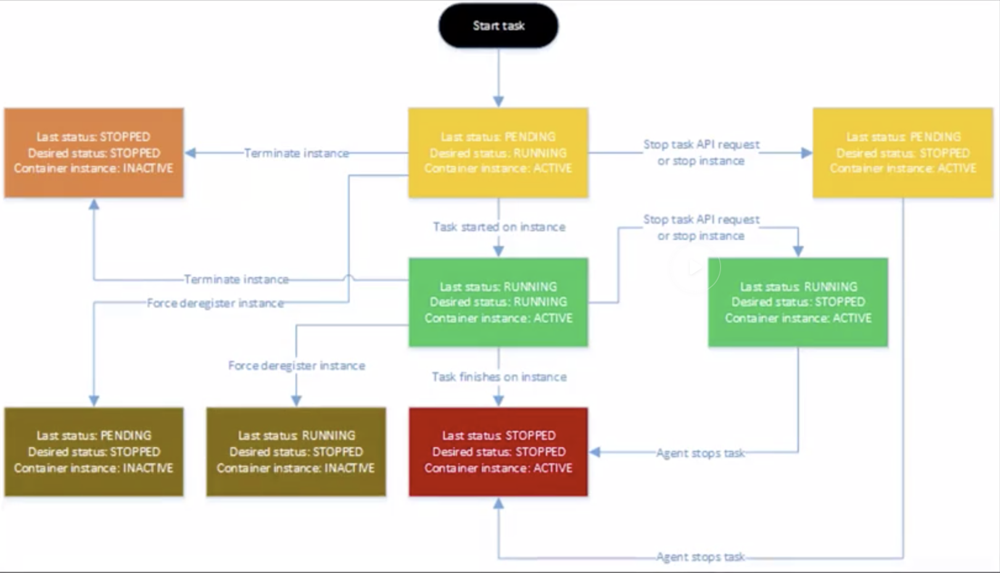

# ECS Scheduler

- 3 ways to schedule a task on your cluster
- The scheduler helps you utilize your resources with least effort on the user's part and in the best way possible. 
- Scheduler is flexible and we can use the instance as well if needed and we can even use third-party scheduler. 

## Services

- Services are long lived and stateless (like a Web application)
- Define how many service instances you want (like Autoscaling, it will sclae up whenever any instance is down.)
- Works with Elastic Load Balancing as well (Hook up the service to ELB)

**3 steps for placing a service into your cluster**

- Compare the task definition's attributes to the state of the cluster and then check if the container instance can run the required attributes (cpu, memory, etc.)
- The scheduler has a list of container instances and check how many service instances are running in an availability zone. Keeping this in mind, it will place a new instance in an availability zone that has least amount of tasks running on it
- Check how many service instances are running on container instances and place a new task on the container instance that has least amount of tasks running on it. 


## Running Tasks

- Tasks that are short lived or 1 off tasks that exit when done can be run with Scheduler. (Video encoding or DB migration for example)
- We can use `RunTask` which *randomly* distributes tasks on your cluster. But, it minimizes specific instances from getting overloaded. 


## Starting Tasks

- Running tasks and starting tasks are different
- `StartTask` lets you *pick* where you want to run a task
- StartTasks lets you build or use your own scheduler

Services and tasks have 3 states:
- PENDING
- RUNNING
- STOPPED

The container agent is responsible for state tracking

## Task LifeCycle



```bash
aws> ecs create-service --cluster deepdive --service-name web --task-definition web  --desired-count 1
----------------------------------------------------------------------------------------
|                                     CreateService                                    |
+--------------------------------------------------------------------------------------+
||                                       service                                      ||
|+-----------------------+------------------------------------------------------------+|
||  clusterArn           |  arn:aws:ecs:us-east-1:289503391411:cluster/deepdive       ||
||  createdAt            |  1567608636.767                                            ||
||  desiredCount         |  1                                                         ||
||  enableECSManagedTags |  False                                                     ||
||  launchType           |  EC2                                                       ||
||  pendingCount         |  0                                                         ||
||  propagateTags        |  NONE                                                      ||
||  runningCount         |  0                                                         ||
||  schedulingStrategy   |  REPLICA                                                   ||
||  serviceArn           |  arn:aws:ecs:us-east-1:289503391411:service/web            ||
||  serviceName          |  web                                                       ||
||  status               |  ACTIVE                                                    ||
||  taskDefinition       |  arn:aws:ecs:us-east-1:289503391411:task-definition/web:4  ||
|+-----------------------+------------------------------------------------------------+|
|||                              deploymentConfiguration                             |||
||+----------------------------------------------------------------+-----------------+||
|||  maximumPercent                                                |  200            |||
|||  minimumHealthyPercent                                         |  100            |||
||+----------------------------------------------------------------+-----------------+||
|||                                    deployments                                   |||
||+-----------------+----------------------------------------------------------------+||
|||  createdAt      |  1567608636.767                                                |||
|||  desiredCount   |  1                                                             |||
|||  id             |  ecs-svc/9223370469246139040                                   |||
|||  launchType     |  EC2                                                           |||
|||  pendingCount   |  0                                                             |||
|||  runningCount   |  0                                                             |||
|||  status         |  PRIMARY                                                       |||
|||  taskDefinition |  arn:aws:ecs:us-east-1:289503391411:task-definition/web:4      |||
|||  updatedAt      |  1567608636.767                                                |||
||+-----------------+----------------------------------------------------------------+||
```

```bash
aws> ecs list-services --cluster deepdive
------------------------------------------------------
|                    ListServices                    |
+----------------------------------------------------+
||                    serviceArns                   ||
|+--------------------------------------------------+|
||  arn:aws:ecs:us-east-1:289503391411:service/web  ||
|+--------------------------------------------------+|
```


```bash
aws> ecs describe-services --cluster deepdive --services web
---------------------------------------------------------------------------------------------------------------------------------------------------
|                                                                DescribeServices                                                                 |
+-------------------------------------------------------------------------------------------------------------------------------------------------+
||                                                                   services                                                                    ||
|+---------------------------------------+-------------------------------------------------------------------------------------------------------+|
||  clusterArn                           |  arn:aws:ecs:us-east-1:289503391411:cluster/deepdive                                                  ||
||  createdAt                            |  1567608636.767                                                                                       ||
||  desiredCount                         |  1                                                                                                    ||
||  enableECSManagedTags                 |  False                                                                                                ||
||  launchType                           |  EC2                                                                                                  ||
||  pendingCount                         |  0                                                                                                    ||
||  propagateTags                        |  NONE                                                                                                 ||
||  runningCount                         |  1                                                                                                    ||
||  schedulingStrategy                   |  REPLICA                                                                                              ||
||  serviceArn                           |  arn:aws:ecs:us-east-1:289503391411:service/web                                                       ||
||  serviceName                          |  web                                                                                                  ||
||  status                               |  ACTIVE                                                                                               ||
||  taskDefinition                       |  arn:aws:ecs:us-east-1:289503391411:task-definition/web:4                                             ||
|+---------------------------------------+-------------------------------------------------------------------------------------------------------+|
|||                                                           deploymentConfiguration                                                           |||
||+--------------------------------------------------------------------------------------------------------------+------------------------------+||
|||  maximumPercent                                                                                              |  200                         |||
|||  minimumHealthyPercent                                                                                       |  100                         |||
||+--------------------------------------------------------------------------------------------------------------+------------------------------+||
|||                                                                 deployments                                                                 |||
||+-------------------------------+-------------------------------------------------------------------------------------------------------------+||
|||  createdAt                    |  1567608636.767                                                                                             |||
|||  desiredCount                 |  1                                                                                                          |||
|||  id                           |  ecs-svc/9223370469246139040                                                                                |||
|||  launchType                   |  EC2                                                                                                        |||
|||  pendingCount                 |  0                                                                                                          |||
|||  runningCount                 |  1                                                                                                          |||
|||  status                       |  PRIMARY                                                                                                    |||
|||  taskDefinition               |  arn:aws:ecs:us-east-1:289503391411:task-definition/web:4                                                   |||
|||  updatedAt                    |  1567608650.671                                                                                             |||
||+-------------------------------+-------------------------------------------------------------------------------------------------------------+||
|||                                                                   events                                                                    |||
||+----------------+----------------------------------------+-----------------------------------------------------------------------------------+||
|||    createdAt   |                  id                    |                                      message                                      |||
||+----------------+----------------------------------------+-----------------------------------------------------------------------------------+||
|||  1567608650.678|  8db7eb66-89f8-4bd0-bb9d-1a3c5f7b1d41  |  (service web) has reached a steady state.                                        |||
|||  1567608640.905|  20d60fcb-e5af-41dc-a37c-b692a68c9618  |  (service web) has started 1 tasks: (task 6b939534-e746-4375-ab3e-6c12e17b55d9).  |||
||+----------------+----------------------------------------+-----------------------------------------------------------------------------------+||
```


```bash
aws> ecs update-service --cluster deepdive --service web --task-definition web --desired-count 2
--------------------------------------------------------------------------------------------------------------------------------------------------------------------------------------------------------------
|                                                                                                UpdateService                                                                                               |
+------------------------------------------------------------------------------------------------------------------------------------------------------------------------------------------------------------+
||                                                                                                  service                                                                                                 ||
|+--------------------------------------------------------+-------------------------------------------------------------------------------------------------------------------------------------------------+|
||  clusterArn                                            |  arn:aws:ecs:us-east-1:289503391411:cluster/deepdive                                                                                            ||
||  createdAt                                             |  1567608636.767                                                                                                                                 ||
||  desiredCount                                          |  2                                                                                                                                              ||
||  enableECSManagedTags                                  |  False                                                                                                                                          ||
||  launchType                                            |  EC2                                                                                                                                            ||
||  pendingCount                                          |  0                                                                                                                                              ||
||  propagateTags                                         |  NONE                                                                                                                                           ||
||  runningCount                                          |  1                                                                                                                                              ||
||  schedulingStrategy                                    |  REPLICA                                                                                                                                        ||
||  serviceArn                                            |  arn:aws:ecs:us-east-1:289503391411:service/web                                                                                                 ||
||  serviceName                                           |  web                                                                                                                                            ||
||  status                                                |  ACTIVE                                                                                                                                         ||
||  taskDefinition                                        |  arn:aws:ecs:us-east-1:289503391411:task-definition/web:5                                                                                       ||
|+--------------------------------------------------------+-------------------------------------------------------------------------------------------------------------------------------------------------+|
|||                                                                                         deploymentConfiguration                                                                                        |||
||+------------------------------------------------------------------------------------------------------------------------------------------------------------+-------------------------------------------+||
|||  maximumPercent                                                                                                                                            |  200                                      |||
|||  minimumHealthyPercent                                                                                                                                     |  100                                      |||
||+------------------------------------------------------------------------------------------------------------------------------------------------------------+-------------------------------------------+||
|||                                                                                               deployments                                                                                              |||
||+----------------+---------------+------------------------------+-------------+---------------+---------------+----------+------------------------------------------------------------+------------------+||
|||    createdAt   | desiredCount  |             id               | launchType  | pendingCount  | runningCount  | status   |                      taskDefinition                        |    updatedAt     |||
||+----------------+---------------+------------------------------+-------------+---------------+---------------+----------+------------------------------------------------------------+------------------+||
|||  1567610184.168|  2            |  ecs-svc/9223370469244591639 |  EC2        |  0            |  0            |  PRIMARY |  arn:aws:ecs:us-east-1:289503391411:task-definition/web:5  |  1567610184.168  |||
|||  1567608636.767|  1            |  ecs-svc/9223370469246139040 |  EC2        |  0            |  1            |  ACTIVE  |  arn:aws:ecs:us-east-1:289503391411:task-definition/web:4  |  1567608650.671  |||
||+----------------+---------------+------------------------------+-------------+---------------+---------------+----------+------------------------------------------------------------+------------------+||
|||                                                                                                 events                                                                                                 |||
||+------------------------+--------------------------------------------------------+----------------------------------------------------------------------------------------------------------------------+||
|||        createdAt       |                          id                            |                                                       message                                                        |||
||+------------------------+--------------------------------------------------------+----------------------------------------------------------------------------------------------------------------------+||
|||  1567608650.678        |  8db7eb66-89f8-4bd0-bb9d-1a3c5f7b1d41                  |  (service web) has reached a steady state.                                                                           |||
|||  1567608640.905        |  20d60fcb-e5af-41dc-a37c-b692a68c9618                  |  (service web) has started 1 tasks: (task 6b939534-e746-4375-ab3e-6c12e17b55d9).                                     |||
||+------------------------+--------------------------------------------------------+----------------------------------------------------------------------------------------------------------------------+||
```


To stop the service

```bash
aws> ecs update-service --cluster deepdive --service web --task-definition web --desired-count 0
----------------------------------------------------------------------------------------------------------------------------------------------------------------------------------------------------------------------------------------------------------------------------------------------------------------------------------------------------------------------------------------------
|                                                                                                                                                                                        UpdateService                                                                                                                                                                                       |
+--------------------------------------------------------------------------------------------------------------------------------------------------------------------------------------------------------------------------------------------------------------------------------------------------------------------------------------------------------------------------------------------+
||                                                                                                                                                                                          service                                                                                                                                                                                         ||
|+-----------------------------------------------------------------------------------------------------------+------------------------------------------------------------------------------------------------------------------------------------------------------------------------------------------------------------------------------------------------------------------------------+|
||  clusterArn                                                                                               |  arn:aws:ecs:us-east-1:289503391411:cluster/deepdive                                                                                                                                                                                                                         ||
||  createdAt                                                                                                |  1567608636.767                                                                                                                                                                                                                                                              ||
||  desiredCount                                                                                             |  0                                                                                                                                                                                                                                                                           ||
||  enableECSManagedTags                                                                                     |  False                                                                                                                                                                                                                                                                       ||
||  launchType                                                                                               |  EC2                                                                                                                                                                                                                                                                         ||
||  pendingCount                                                                                             |  0                                                                                                                                                                                                                                                                           ||
||  propagateTags                                                                                            |  NONE                                                                                                                                                                                                                                                                        ||
||  runningCount                                                                                             |  1                                                                                                                                                                                                                                                                           ||
||  schedulingStrategy                                                                                       |  REPLICA                                                                                                                                                                                                                                                                     ||
||  serviceArn                                                                                               |  arn:aws:ecs:us-east-1:289503391411:service/web                                                                                                                                                                                                                              ||
||  serviceName                                                                                              |  web                                                                                                                                                                                                                                                                         ||
||  status                                                                                                   |  ACTIVE                                                                                                                                                                                                                                                                      ||
||  taskDefinition                                                                                           |  arn:aws:ecs:us-east-1:289503391411:task-definition/web:5                                                                                                                                                                                                                    ||
|+-----------------------------------------------------------------------------------------------------------+------------------------------------------------------------------------------------------------------------------------------------------------------------------------------------------------------------------------------------------------------------------------------+|
|||                                                                                                                                                                                 deploymentConfiguration                                                                                                                                                                                |||
||+-----------------------------------------------------------------------------------------------------------------------------------------------------------------------------------------------------------------------------------------------------------------------------------------------------+----------------------------------------------------------------------------------+||
|||  maximumPercent                                                                                                                                                                                                                                                                                     |  200                                                                             |||
|||  minimumHealthyPercent                                                                                                                                                                                                                                                                              |  100                                                                             |||
||+-----------------------------------------------------------------------------------------------------------------------------------------------------------------------------------------------------------------------------------------------------------------------------------------------------+----------------------------------------------------------------------------------+||
|||                                                                                                                                                                                       deployments                                                                                                                                                                                      |||
||+--------------------------------+-----------------------------+----------------------------------------------------------+-------------------------+-----------------------------+-----------------------------+--------------------+----------------------------------------------------------------------------------------------------------------+----------------------------------+||
|||            createdAt           |        desiredCount         |                           id                             |       launchType        |        pendingCount         |        runningCount         |      status        |                                                taskDefinition                                                  |            updatedAt             |||
||+--------------------------------+-----------------------------+----------------------------------------------------------+-------------------------+-----------------------------+-----------------------------+--------------------+----------------------------------------------------------------------------------------------------------------+----------------------------------+||
|||  1567610184.168                |  0                          |  ecs-svc/9223370469244591639                             |  EC2                    |  0                          |  0                          |  PRIMARY           |  arn:aws:ecs:us-east-1:289503391411:task-definition/web:5                                                      |  1567610184.168                  |||
|||  1567608636.767                |  1                          |  ecs-svc/9223370469246139040                             |  EC2                    |  0                          |  1                          |  ACTIVE            |  arn:aws:ecs:us-east-1:289503391411:task-definition/web:4                                                      |  1567610184.168                  |||
||+--------------------------------+-----------------------------+----------------------------------------------------------+-------------------------+-----------------------------+-----------------------------+--------------------+----------------------------------------------------------------------------------------------------------------+----------------------------------+||
|||                                                                                                                                                                                         events                                                                                                                                                                                         |||
||+----------------+---------------------------------------+-------------------------------------------------------------------------------------------------------------------------------------------------------------------------------------------------------------------------------------------------------------------------------------------------------------------------------+||
|||    createdAt   |                  id                   |                                                                                                                                                            message                                                                                                                                                            |||
||+----------------+---------------------------------------+-------------------------------------------------------------------------------------------------------------------------------------------------------------------------------------------------------------------------------------------------------------------------------------------------------------------------------+||
|||  1567610200.241|  edbdedf6-951a-4a93-aa62-358e9af36e4a |  (service web) was unable to place a task because no container instance met all of its requirements. The closest matching (container-instance 6368caa4-6386-4a5b-9c60-ac752591b819) is already using a port required by your task. For more information, see the Troubleshooting section of the Amazon ECS Developer Guide.   |||
|||  1567608650.678|  8db7eb66-89f8-4bd0-bb9d-1a3c5f7b1d41 |  (service web) has reached a steady state.                                                                                                                                                                                                                                                                                    |||
|||  1567608640.905|  20d60fcb-e5af-41dc-a37c-b692a68c9618 |  (service web) has started 1 tasks: (task 6b939534-e746-4375-ab3e-6c12e17b55d9).                                                                                                                                                                                                                                              |||
||+----------------+---------------------------------------+-------------------------------------------------------------------------------------------------------------------------------------------------------------------------------------------------------------------------------------------------------------------------------------------------------------------------------+||
```

```bash
aws> ecs delete-service --cluster deepdive --service web
----------------------------------------------------------------------------------------------------------------------------------------------------------------------------------------------------------------------------------------------------------------------------------------------------------------------------------------------------------------------------------------------
|                                                                                                                                                                                        DeleteService                                                                                                                                                                                       |
+--------------------------------------------------------------------------------------------------------------------------------------------------------------------------------------------------------------------------------------------------------------------------------------------------------------------------------------------------------------------------------------------+
||                                                                                                                                                                                          service                                                                                                                                                                                         ||
|+-----------------------------------------------------------------------------------------------------------+------------------------------------------------------------------------------------------------------------------------------------------------------------------------------------------------------------------------------------------------------------------------------+|
||  clusterArn                                                                                               |  arn:aws:ecs:us-east-1:289503391411:cluster/deepdive                                                                                                                                                                                                                         ||
||  createdAt                                                                                                |  1567608636.767                                                                                                                                                                                                                                                              ||
||  desiredCount                                                                                             |  0                                                                                                                                                                                                                                                                           ||
||  enableECSManagedTags                                                                                     |  False                                                                                                                                                                                                                                                                       ||
||  launchType                                                                                               |  EC2                                                                                                                                                                                                                                                                         ||
||  pendingCount                                                                                             |  0                                                                                                                                                                                                                                                                           ||
||  propagateTags                                                                                            |  NONE                                                                                                                                                                                                                                                                        ||
||  runningCount                                                                                             |  0                                                                                                                                                                                                                                                                           ||
||  schedulingStrategy                                                                                       |  REPLICA                                                                                                                                                                                                                                                                     ||
||  serviceArn                                                                                               |  arn:aws:ecs:us-east-1:289503391411:service/web                                                                                                                                                                                                                              ||
||  serviceName                                                                                              |  web                                                                                                                                                                                                                                                                         ||
||  status                                                                                                   |  DRAINING                                                                                                                                                                                                                                                                    ||
||  taskDefinition                                                                                           |  arn:aws:ecs:us-east-1:289503391411:task-definition/web:5                                                                                                                                                                                                                    ||
|+-----------------------------------------------------------------------------------------------------------+------------------------------------------------------------------------------------------------------------------------------------------------------------------------------------------------------------------------------------------------------------------------------+|
|||                                                                                                                                                                                 deploymentConfiguration                                                                                                                                                                                |||
||+-----------------------------------------------------------------------------------------------------------------------------------------------------------------------------------------------------------------------------------------------------------------------------------------------------+----------------------------------------------------------------------------------+||
|||  maximumPercent                                                                                                                                                                                                                                                                                     |  200                                                                             |||
|||  minimumHealthyPercent                                                                                                                                                                                                                                                                              |  100                                                                             |||
||+-----------------------------------------------------------------------------------------------------------------------------------------------------------------------------------------------------------------------------------------------------------------------------------------------------+----------------------------------------------------------------------------------+||
|||                                                                                                                                                                                       deployments                                                                                                                                                                                      |||
||+--------------------------------+-----------------------------+----------------------------------------------------------+-------------------------+-----------------------------+-----------------------------+--------------------+----------------------------------------------------------------------------------------------------------------+----------------------------------+||
|||            createdAt           |        desiredCount         |                           id                             |       launchType        |        pendingCount         |        runningCount         |      status        |                                                taskDefinition                                                  |            updatedAt             |||
||+--------------------------------+-----------------------------+----------------------------------------------------------+-------------------------+-----------------------------+-----------------------------+--------------------+----------------------------------------------------------------------------------------------------------------+----------------------------------+||
|||  1567610184.168                |  0                          |  ecs-svc/9223370469244591639                             |  EC2                    |  0                          |  0                          |  PRIMARY           |  arn:aws:ecs:us-east-1:289503391411:task-definition/web:5                                                      |  1567610345.337                  |||
|||  1567608636.767                |  1                          |  ecs-svc/9223370469246139040                             |  EC2                    |  0                          |  0                          |  ACTIVE            |  arn:aws:ecs:us-east-1:289503391411:task-definition/web:4                                                      |  1567610184.168                  |||
||+--------------------------------+-----------------------------+----------------------------------------------------------+-------------------------+-----------------------------+-----------------------------+--------------------+----------------------------------------------------------------------------------------------------------------+----------------------------------+||
|||                                                                                                                                                                                         events                                                                                                                                                                                         |||
||+----------------+---------------------------------------+-------------------------------------------------------------------------------------------------------------------------------------------------------------------------------------------------------------------------------------------------------------------------------------------------------------------------------+||
|||    createdAt   |                  id                   |                                                                                                                                                            message                                                                                                                                                            |||
||+----------------+---------------------------------------+-------------------------------------------------------------------------------------------------------------------------------------------------------------------------------------------------------------------------------------------------------------------------------------------------------------------------------+||
|||  1567610345.38 |  affb2376-1662-48db-9289-97c56c373cc7 |  (service web) has stopped 1 running tasks: (task 6b939534-e746-4375-ab3e-6c12e17b55d9).                                                                                                                                                                                                                                      |||
|||  1567610200.241|  edbdedf6-951a-4a93-aa62-358e9af36e4a |  (service web) was unable to place a task because no container instance met all of its requirements. The closest matching (container-instance 6368caa4-6386-4a5b-9c60-ac752591b819) is already using a port required by your task. For more information, see the Troubleshooting section of the Amazon ECS Developer Guide.   |||
|||  1567608650.678|  8db7eb66-89f8-4bd0-bb9d-1a3c5f7b1d41 |  (service web) has reached a steady state.                                                                                                                                                                                                                                                                                    |||
|||  1567608640.905|  20d60fcb-e5af-41dc-a37c-b692a68c9618 |  (service web) has started 1 tasks: (task 6b939534-e746-4375-ab3e-6c12e17b55d9).                                                                                                                                                                                                                                              |||
||+----------------+---------------------------------------+-------------------------------------------------------------------------------------------------------------------------------------------------------------------------------------------------------------------------------------------------------------------------------------------------------------------------------+||
```