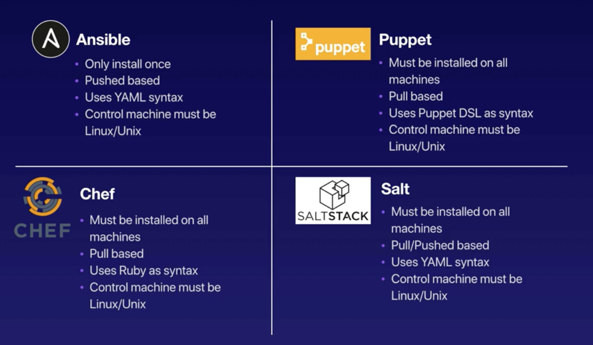

# Ansible

## Intro

- Ansible is an open source tool that enables autoamtion, configuration and orchestration of infrastructure. Helps in:
    - Automation of app deployment
    - Manage multi server systems
    - Reduce complexity
- When using Ansible, we build out the entire system in code and store the code in source control. Rollbacks will be available when needed and the code can be shared with other team members. 
- Produces reliable and repeatable systems and reduces human error in spinning up the infrastructure multiple times. 
- Written in `Python` and the scripting language used is YAML. 
- Commands are sent to nodes (in parallel) via `SSH` and executed sequentially on each respective node.
- Ansible can be used in:
    - *Mass deployments*
    - As a configuration management tool to ensure identical environments when *scaling* to meet demands (during high spikes of traffic)
    - *Migrating environments* from integration, testing and production in a reliable and dependable way. 
    - *Failure prevention* - As a tool for reviewing change logs and rolling back applications if failures do occur.



## Setup inventory machines

- Create sandbox servers that will need to be configured and managed.
- Inventory, child and node servers naming can be used interchangeably.
- These are the servers we will configure using Ansible.
- Can create 3 VMs using [this](src/setup-env.yml) template.

## Install Ansible

Ansible can be installed via pip.
```bash
    $ sudo pip3 install ansible
    $ ansible --version
        ansible 2.9.2
        config file = None
        configured module search path = ['~/.ansible/plugins/modules', '/usr/share/ansible/plugins/modules']
        ansible python module location = /usr/local/lib/python3.7/site-packages/ansible
        executable location = /usr/local/bin/ansible
        python version = 3.7.5 (default, Nov  1 2019, 02:16:23) [Clang 11.0.0 (clang-1100.0.33.8)]
```

To check that the control machine (Laptop) has access to the node VMs, we can SSH into those systems and confirm access to the machines. 

```bash
    $ ssh -i ~/.ssh/ansible-2020.pem ec2-user@54.152.194.112
    $ ssh -i ~/.ssh/ansible-2020.pem ec2-user@3.211.181.182
    $ ssh -i ~/.ssh/ansible-2020.pem ec2-user@54.89.101.67
```

## Setup inventory file

- Ansible must be given information on the inventory servers before we can execute commands on the node machines.
- The file can either be static or dynamic.
    - **Static inventory file:** Create an `inventory file` containing the node/inventory server information. This file lists the hostnames and groups. 
        ```bash
        # hosts-dev

        [webservers]
        54.152.194.112
        3.211.181.182

        [loadbalancers]
        lb ansible_host=54.89.101.67
        ```
    - **[Dynamic inventory file:](https://docs.ansible.com/ansible/latest/user_guide/intro_dynamic_inventory.html)** If you use Amazon Web Services EC2, maintaining an inventory file might not be the best approach, because hosts may come and go over time, be managed by external applications, or you might even be using AWS autoscaling. For this reason, you can use the [EC2 external inventory](https://raw.githubusercontent.com/ansible/ansible/devel/contrib/inventory/ec2.py) script. You can use this script in one of two ways: 
        - The easiest is to use Ansible’s `-i` command line option and specify the path to the script after marking it executable:
            ```bash
                $ ansible -i ec2.py -u ubuntu us-east-1d -m ping
            ```
        - The second option is to copy the script to `/etc/ansible/hosts` and `chmod +x` it. You must also copy the ec2.ini file to `/etc/ansible/ec2.ini`. Then you can run ansible as you would normally.
- The inventory file can include inventory specific parameters like non-standard SSH port numbers or aliases using `<name> ansible_host=<IP address>`.
- Default Ansible inventory is located in `/etc/ansible/hosts`
- Reference a different inventory by using `-i <path>` in CLI.