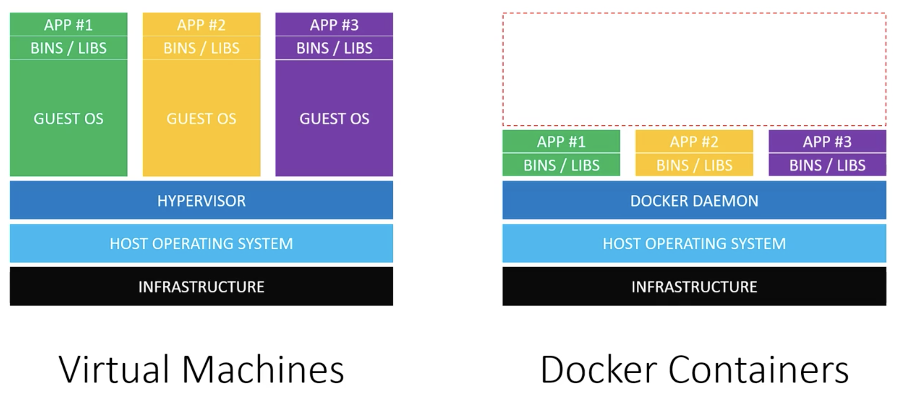
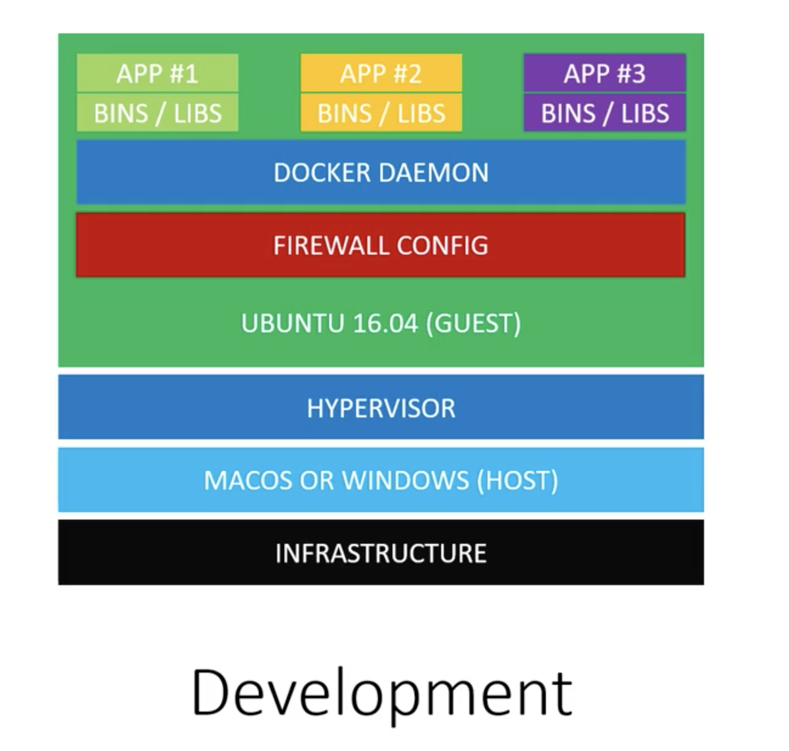
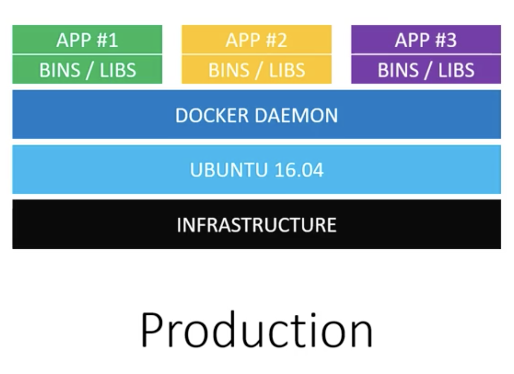
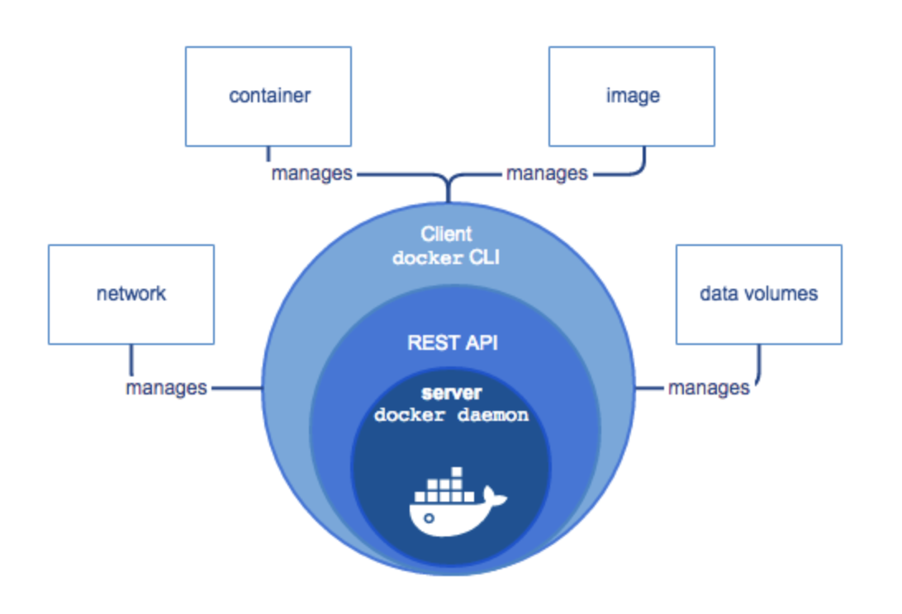
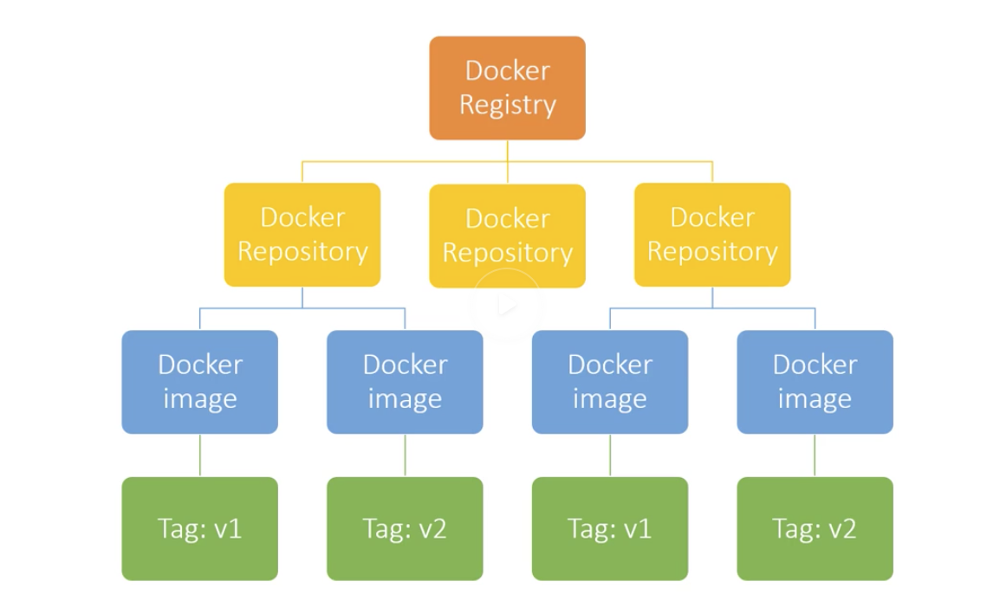
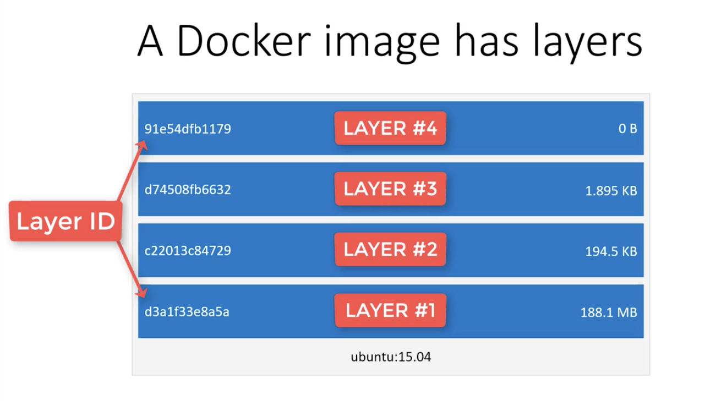

# Docker Deepdive

## VMs vs Containers



- Two types of hypervisors:
    - Type 1: Direct link to infrastructure (Hyperkit on Mac/Hyper-V on Windows). Generally, more efficient than Type 2 due to their direct link to hardware.
    - Type 2: Runs as an app on the Host OS (VMWare/VirtualBox)

- While working with VMs, each VM will have its own OS that needs CPU, memory and other resources.
- While working with containers, the need for separate OS is eliminated by the use of Docker daemon that communicates directly with the Host OS and knows how to assign resources to running docker containers. It also makes sure each container is isolated from Host OS and other containers. 
- VMs take minutes to start while Docker containers take milliseconds. 
- VMs wastes resources by allocating separate OS for each app while Docker containers save resources by using Docker daemon. 
- While VMs `isolate systems`, Docker containers `isolate applications`.

## When to use VMs and Docker

The setup might be different in development and production environments. If we want to test the Firewall config for Ubuntu OS that is running Docker containers, this cannot be done if we solely rely on containers when the host OS on dev setup might be Windows or Mac OS and not Ubuntu. To solve this issue, we can run a VM in the dev setup which has the containers in it. 

Development Setup             |  Production Setup
:-------------------------:|:-------------------------:
  |  

## Docker's Architecture

!!! info "[Docker Arch source](https://docs.docker.com/engine/docker-overview/)"
Docker is written in Go and takes advantage of several features of the `Linux kernel` to deliver its functionality.

- Because the Docker Engine daemon uses Linux-specific kernel features, you can't run Docker Engine natively on Windows. Instead, you must use the Docker Machine command, docker-machine, to create and attach to a small Linux VM on your machine. This VM hosts Docker Engine for you on your Windows system.

Docker Engine is a client-server application with these major components:

- A server which is a type of long-running program called a daemon process (the dockerd command).
- A REST API which specifies interfaces that programs can use to talk to the daemon and instruct it what to do.
- A command line interface (CLI) client (the docker command).




**Namespaces:**
Docker uses a technology called namespaces to provide the isolated workspace called the container. When you run a container, Docker creates a set of namespaces for that container.These namespaces provide a layer of isolation. Each aspect of a container runs in a separate namespace and its access is limited to that namespace.

Docker Engine uses namespaces such as the following on Linux:

- The `pid` namespace: Process isolation (PID: Process ID).
- The `net` namespace: Managing network interfaces (NET: Networking).
- The `ipc` namespace: Managing access to IPC resources (IPC: InterProcess Communication).
- The `mnt` namespace: Managing filesystem mount points (MNT: Mount).
- The `uts` namespace: Isolating kernel and version identifiers. (UTS: Unix Timesharing System).

**Control groups:**
Docker Engine on Linux also relies on another technology called control groups (cgroups). A cgroup limits an application to a specific set of resources. Control groups allow Docker Engine to share available hardware resources to containers and optionally enforce limits and constraints. For example, you can limit the memory available to a specific container.

**Union file systems:**
Union file systems, or UnionFS, are file systems that operate by creating layers, making them very lightweight and fast. Docker Engine uses UnionFS to provide the building blocks for containers. Docker Engine can use multiple UnionFS variants, including AUFS, btrfs, vfs, and DeviceMapper.

**Container format:**
Docker Engine combines the namespaces, control groups, and UnionFS into a wrapper called a container format. The default container format is libcontainer. In the future, Docker may support other container formats by integrating with technologies such as BSD Jails or Solaris Zones.

## Images and Containers
A docker image cannot be changed. A new version of the image can be created using the base image. A container and image are not interchangeable. A container is run using the image. 

    The act of running an image is called a container
    Image can be viewed as class
    Container can be seen as instance of that class

Many containers can be run using a single image. Containers are immutable. Changes are not maintained after stopping a docker container. 



Automated Builds can be triggered from DockerHub by connecting the account to Github. 

    We can create automated workflows like:

        - pushing code changes to github to trigger a CI task
        - kick off CI tasks like testing using the CI server
        - build a new docker image after testing is completed
        - send a custom webhook to a server
        - receive the webhook from the server
        - pull new docker image after receiving the webhook
        - restart containers with the new docker image

Two ways to build a Docker image:

- Option 1: Run a docker container, make the changes and commit them with `docker commit`
- Option 2: To use a `Dockerfile`

Commit is rarely used to build a docker image. Dockerfile is superior because of its version control support. 

    Dockerfile is a Blueprint of what the docker image will be. 

The reason why docker images are so efficient is that they use Layers. While pulling the latest image, it compares what has changed between the layers and downloads only the change by using Layers. Building docker images goes with the same logic by using Layers.


## Building Docker image

??? info "Docker CLI commands"
    ```bash
    $ docker --help

    Usage:	docker [OPTIONS] COMMAND

    A self-sufficient runtime for containers

    Options:
        --config string      Location of client config files (default
                            "/Users/pradeepgorthi/.docker")
    -c, --context string     Name of the context to use to connect to the
                            daemon (overrides DOCKER_HOST env var and
                            default context set with "docker context use")
    -D, --debug              Enable debug mode
    -H, --host list          Daemon socket(s) to connect to
    -l, --log-level string   Set the logging level
                            ("debug"|"info"|"warn"|"error"|"fatal")
                            (default "info")
        --tls                Use TLS; implied by --tlsverify
        --tlscacert string   Trust certs signed only by this CA (default
                            "/Users/pradeepgorthi/.docker/ca.pem")
        --tlscert string     Path to TLS certificate file (default
                            "/Users/pradeepgorthi/.docker/cert.pem")
        --tlskey string      Path to TLS key file (default
                            "/Users/pradeepgorthi/.docker/key.pem")
        --tlsverify          Use TLS and verify the remote
    -v, --version            Print version information and quit

    Management Commands:
    builder     Manage builds
    config      Manage Docker configs
    container   Manage containers
    context     Manage contexts
    image       Manage images
    network     Manage networks
    node        Manage Swarm nodes
    plugin      Manage plugins
    secret      Manage Docker secrets
    service     Manage services
    stack       Manage Docker stacks
    swarm       Manage Swarm
    system      Manage Docker
    trust       Manage trust on Docker images
    volume      Manage volumes

    Commands:
    attach      Attach local standard input, output, and error streams to a running container
    build       Build an image from a Dockerfile
    commit      Create a new image from a container's changes
    cp          Copy files/folders between a container and the local filesystem
    create      Create a new container
    diff        Inspect changes to files or directories on a container's filesystem
    events      Get real time events from the server
    exec        Run a command in a running container
    export      Export a container's filesystem as a tar archive
    history     Show the history of an image
    images      List images
    import      Import the contents from a tarball to create a filesystem image
    info        Display system-wide information
    inspect     Return low-level information on Docker objects
    kill        Kill one or more running containers
    load        Load an image from a tar archive or STDIN
    login       Log in to a Docker registry
    logout      Log out from a Docker registry
    logs        Fetch the logs of a container
    pause       Pause all processes within one or more containers
    port        List port mappings or a specific mapping for the container
    ps          List containers
    pull        Pull an image or a repository from a registry
    push        Push an image or a repository to a registry
    rename      Rename a container
    restart     Restart one or more containers
    rm          Remove one or more containers
    rmi         Remove one or more images
    run         Run a command in a new container
    save        Save one or more images to a tar archive (streamed to STDOUT by default)
    search      Search the Docker Hub for images
    start       Start one or more stopped containers
    stats       Display a live stream of container(s) resource usage statistics
    stop        Stop one or more running containers
    tag         Create a tag TARGET_IMAGE that refers to SOURCE_IMAGE
    top         Display the running processes of a container
    unpause     Unpause all processes within one or more containers
    update      Update configuration of one or more containers
    version     Show the Docker version information
    wait        Block until one or more containers stop, then print their exit codes

    Run 'docker COMMAND --help' for more information on a command.
    ```

Sample Docker file:
```Dockerfile
FROM python:3.8-alpine

# Runs a command in the image 
RUN mkdir /app
# Changes Working directory
WORKDIR /app

COPY requirements.txt requirements.txt
RUN pip3 install -r requirements.txt

# Copy all the files in the current/below dir to the destination directory in the image
COPY . .

LABEL maintainer="deepgorthi" \
    version="1.0"

# Default command that will be run when the docker image is ran as opposed to `RUN` which is executed when docker image is in build stage. 
CMD flask run --host=0.0.0.0 --port=5000
```

Docker image can be built using:

??? info "docker image build -t |image_name| |project_dir|"
    ```bash
    $ docker image build -t web1 .
    Sending build context to Docker daemon  6.144kB
    Step 1/8 : FROM python:3.8-alpine
    3.8-alpine: Pulling from library/python
    89d9c30c1d48: Already exists
    910c49c00810: Pull complete
    66564da92047: Pull complete
    bb0265c0d9a9: Pull complete
    b86dfbfbb035: Pull complete
    Digest: sha256:7f465d82a49e092b609fa97cea8ea761c9aa4fa6cab05f4876150e28bf16bcc3
    Status: Downloaded newer image for python:3.8-alpine
    ---> 59acf2b3028c
    Step 2/8 : RUN mkdir /app
    ---> Running in 35c9bfe4094f
    Removing intermediate container 35c9bfe4094f
    ---> 189a38c581b5
    Step 3/8 : WORKDIR /app
    ---> Running in 548c3c0d8c92
    Removing intermediate container 548c3c0d8c92
    ---> 86fed1cc4245
    Step 4/8 : COPY requirements.txt requirements.txt
    ---> 09f541a26042
    Step 5/8 : RUN pip3 install -r requirements.txt
    ---> Running in 9dd700237426
    Collecting Flask==1.1.1
    Downloading https://files.pythonhosted.org/packages/9b/93/628509b8d5dc749656a9641f4caf13540e2cdec85276964ff8f43bbb1d3b/Flask-1.1.1-py2.py3-none-any.whl (94kB)
    Collecting click>=5.1
    Downloading https://files.pythonhosted.org/packages/fa/37/45185cb5abbc30d7257104c434fe0b07e5a195a6847506c074527aa599ec/Click-7.0-py2.py3-none-any.whl (81kB)
    Collecting Werkzeug>=0.15
    Downloading https://files.pythonhosted.org/packages/ce/42/3aeda98f96e85fd26180534d36570e4d18108d62ae36f87694b476b83d6f/Werkzeug-0.16.0-py2.py3-none-any.whl (327kB)
    Collecting itsdangerous>=0.24
    Downloading https://files.pythonhosted.org/packages/76/ae/44b03b253d6fade317f32c24d100b3b35c2239807046a4c953c7b89fa49e/itsdangerous-1.1.0-py2.py3-none-any.whl
    Collecting Jinja2>=2.10.1
    Downloading https://files.pythonhosted.org/packages/65/e0/eb35e762802015cab1ccee04e8a277b03f1d8e53da3ec3106882ec42558b/Jinja2-2.10.3-py2.py3-none-any.whl (125kB)
    Collecting MarkupSafe>=0.23
    Downloading https://files.pythonhosted.org/packages/b9/2e/64db92e53b86efccfaea71321f597fa2e1b2bd3853d8ce658568f7a13094/MarkupSafe-1.1.1.tar.gz
    Building wheels for collected packages: MarkupSafe
    Building wheel for MarkupSafe (setup.py): started
    Building wheel for MarkupSafe (setup.py): finished with status 'done'
    Created wheel for MarkupSafe: filename=MarkupSafe-1.1.1-cp38-none-any.whl size=12629 sha256=2ef358e3f930fc77951c40c287a217e2947523c8bed82a87b8b339905517a6bf
    Stored in directory: /root/.cache/pip/wheels/f2/aa/04/0edf07a1b8a5f5f1aed7580fffb69ce8972edc16a505916a77
    Successfully built MarkupSafe
    Installing collected packages: click, Werkzeug, itsdangerous, MarkupSafe, Jinja2, Flask
    Successfully installed Flask-1.1.1 Jinja2-2.10.3 MarkupSafe-1.1.1 Werkzeug-0.16.0 click-7.0 itsdangerous-1.1.0
    Removing intermediate container 9dd700237426
    ---> 698e47e5a545
    Step 6/8 : COPY . .
    ---> bc46e74d6e0d
    Step 7/8 : LABEL maintainer="deepgorthi"     version="1.0"
    ---> Running in 381673955c74
    Removing intermediate container 381673955c74
    ---> b38993872302
    Step 8/8 : CMD flask run --host=0.0.0.0 --port=5000
    ---> Running in deb8e859481f
    Removing intermediate container deb8e859481f
    ---> 6b827d1a1fa1
    Successfully built 6b827d1a1fa1
    Successfully tagged web1:latest
    ```

We can inspect the newly built docker image:
```bash
$ docker image inspect web1
```

Deleting docker image:
```bash
$ docker image rm web1
```

To run a container using the web1 docker image:
```bash
$ docker container run -it -p 5000:5000 --rm -e FLASK_APP=app.py web1
    # '-p' -> Port mapping from localhost to docker image
    # '--rm' -> Deletes the container once it is stopped
    # '-e' -> ENV variable
    # and lastly the docker image (web1)
    # '-d' -> Run the container in detach mode (running in background)
    # '--restart on-failure' -> restart docker container if it stops unexpectedly, cannot be used with '--rm'
    # we can use '-p 5000' instead of '-p 5000:5000' to use a random port on localhost

    * Serving Flask app "app.py"
    * Environment: production
    WARNING: This is a development server. Do not use it in a production deployment.
    Use a production WSGI server instead.
    * Debug mode: off
    * Running on http://0.0.0.0:5000/ (Press CTRL+C to quit)

# Checking logs
$ docker container logs <container_name>

# Checking stats
$ docker container stats

# Using help for container run commands
$ docker container run --help

# To run commands in a detached container
# $ docker container exec -it <container name or ID> <command>
$ docker container exec -it web1 sh
$ docker container exec -it --user "$(id -u):$(id -g)" web1 touch test.txt # create a file with user and not root
```

## Volumes
When changes are made with the source code, the initial docker image does not reflect the code change. The container needs to be re-run with a newly built image that has the recent code change. 

To make this easier, we can make use of Docker Volumes where we can mount local machine dir to the container. 
```bash
$ docker container run -it -p 5000:5000 -e FLASK_APP=app.py --rm --name web1 -e FLASK_DEBUG=1 -v "$PWD:/app" web1
# '-v source:dest' -> This will overwrite the image with the new source code through Dockerfile. 
# This is best for development
# In prod, the dockerfile will copy the source code at the time of build and bake it into the image without a need for volume mounts. 
```

**Named Volumes for Persistent Data:** Instead of providing a local path to mount to docker container, we can provide a named volume so that docker can use that to manage the volume. This is perfect for databases. This is for persisting data after a container stops. 

```bash
$ docker volume create <vol_name>

$ docker volume ls

$ docker volume inspect <vol_name>

# For Redis image, the db will be at /data
$ docker container run -it -p 5000:5000 -e FLASK_APP=app.py --rm --name web1 -e FLASK_DEBUG=1 -v vol_name:/data web1
```

**Sharing Data between Containers:** To share data between containers, in Dockerfile, give an instruction with the path to the dir that will be shared with other containers:

```Dockerfile
VOLUME ["/app/public"]
```

To share data from one container to another, after modifying the Dockerfile for an image, build the image and run the container from that image. Once that is done, run the second container and add `--volumes-from <source_container_name>` to the `docker container` command while starting up the second container. This will result in container2 accessing data from container1. Changes on running container1 can be seen immediately in running container2.


## Networks
Docker creates a few networks for us. 
```bash
$ docker network ls
    NETWORK ID          NAME                DRIVER              SCOPE
    8f87c8b5b9ba        bridge              bridge              local
    8674645af790        host                host                local
    fba1734c012f        none                null                local

$ docker network inspect bridge
```

Bridge network is the default network and all containers are automatically added to this network when created. 

To refer the containers with IP addresses might be a problem when the IP address changes on a reboot. Instead, it is better to use DNS names to refer to Docker contaienrs on a network. If we create our own bridge network with docker, then Docker will configure DNS name for the containers automatically for us. 

To create a bridge network for automatic DNS:
```bash
$ docker network create --driver bridge <network_name>

# Once the network is created, the containers can be assigned into that network by adding a '--net' tag with the network name
$ docker container run --rm -itd -p 5000 -e FLASK_APP=app.py --name web1 -v "$PWD:/app" --net <network_name> web2
```

`Bridge` network driver can only connect docker containers on the same docker host. If we want to connect over multiple docker hosts, then we need to use `overlay` network driver.


## Optimizing Docker Images
Similar to .gitignore, there is a `.dockerignore` file to ignore unnecessary files in the image. The starting point of .dockerignore paths is the `WORKDIR` path set in the Dockerfile. 

```bash
.dockerignore
.git/
.foo/*          # Allows folder to be included but the contents are ignored
**/*.swp        # Recursively ignore all files of specific type
**/*.txt
!special.txt    # All text files will be ignored because of the previous line but special.txt will be included in the image
```

**Running scripts when a container starts:** We can do this by using `ENTRYPOINT` instruction in Dockerfile. ENTRYPOINT lets you run custom scripts. They do not add layers to the docker image as the commands are run after the image is ready from Dockerfile. 

```bash
$ docker system df
    TYPE                TOTAL               ACTIVE              SIZE                RECLAIMABLE
    Images              17                  11                  3.678GB             2.196GB (59%)
    Containers          35                  0                   163MB               163MB (100%)
    Local Volumes       0                   0                   0B                  0B
    Build Cache         0                   0                   0B                  0B

$ docker system prune -y
    WARNING! This will remove:
    - all stopped containers
    - all networks not used by at least one container
    - all dangling images
    - all dangling build cache
```

## docker-compose
