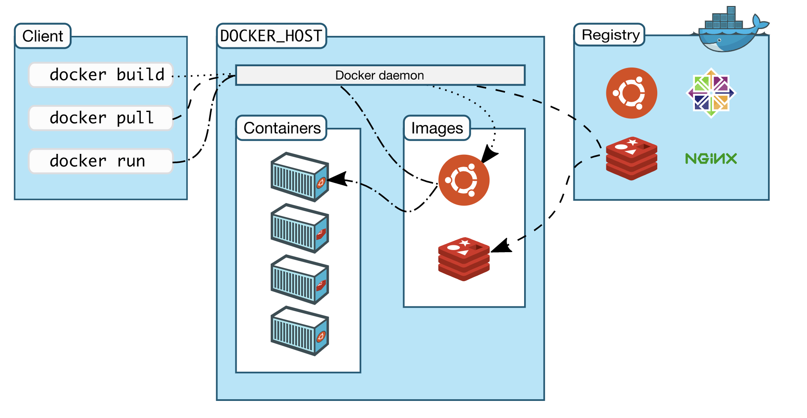

# Docker Deepdive

!!! info "[Link to Course Notes by Nick on aCloudGuru](https://deepgorthi.github.io/notes-docker/notes)"

## VMs vs Containers

- Two types of hypervisors:
    - Type 1: Direct link to infrastructure (Hyperkit on Mac/Hyper-V on Windows). Generally, more efficient than Type 2 due to their direct link to hardware.
    - Type 2: Runs as an app on the Host OS (VMWare/VirtualBox)

- While working with VMs, each VM will have its own OS that needs CPU, memory and other resources.
- While working with containers, the need for separate OS is eliminated by the use of Docker daemon that communicates directly with the Host OS and knows how to assign resources to running docker containers. It also makes sure each container is isolated from Host OS and other containers. 
- VMs take minutes to start while Docker containers take milliseconds. 
- VMs wastes resources by allocating separate OS for each app while Docker containers save resources by using Docker daemon. 
- While VMs `isolate systems`, Docker containers `isolate applications`.

## When to use VMs and Docker

The setup might be different in development and production environments. If we want to test the Firewall config for Ubuntu OS that is running Docker containers, this cannot be done if we solely rely on containers when the host OS on dev setup might be Windows or Mac OS and not Ubuntu. To solve this issue, we can run a VM in the dev setup which has the containers in it. 

Development Setup             |  Production Setup
:-------------------------:|:-------------------------:
  |  

## Docker's Architecture

!!! info "[Docker Arch source](https://docs.docker.com/engine/docker-overview/)"
Docker is written in Go and takes advantage of several features of the `Linux kernel` to deliver its functionality.

- Because the Docker Engine daemon uses Linux-specific kernel features, you can't run Docker Engine natively on Windows. Instead, you must use the Docker Machine command, docker-machine, to create and attach to a small Linux VM on your machine. This VM hosts Docker Engine for you on your Windows system.

Docker Engine is a client-server application with these major components:

- A server which is a type of long-running program called a daemon process (the dockerd command).
- A REST API which specifies interfaces that programs can use to talk to the daemon and instruct it what to do.
- A command line interface (CLI) client (the docker command).

## Namespaces
Docker uses a technology called namespaces to provide the isolated workspace called the container. When you run a container, Docker creates a set of namespaces for that container.These namespaces provide a layer of isolation. Each aspect of a container runs in a separate namespace and its access is limited to that namespace.

Docker Engine uses namespaces such as the following on Linux:

- The `pid` namespace: Process isolation (PID: Process ID).
- The `net` namespace: Managing network interfaces (NET: Networking).
- The `ipc` namespace: Managing access to IPC resources (IPC: InterProcess Communication).
- The `mnt` namespace: Managing filesystem mount points (MNT: Mount).
- The `uts` namespace: Isolating kernel and version identifiers. (UTS: Unix Timesharing System).

## Control groups
Docker Engine on Linux also relies on another technology called control groups (cgroups). A cgroup limits an application to a specific set of resources. Control groups allow Docker Engine to share available hardware resources to containers and optionally enforce limits and constraints. For example, you can limit the memory available to a specific container.

## Union file systems
Union file systems, or UnionFS, are file systems that operate by creating layers, making them very lightweight and fast. Docker Engine uses UnionFS to provide the building blocks for containers. Docker Engine can use multiple UnionFS variants, including AUFS, btrfs, vfs, and DeviceMapper.

## Container format
Docker Engine combines the namespaces, control groups, and UnionFS into a wrapper called a container format. The default container format is libcontainer. In the future, Docker may support other container formats by integrating with technologies such as BSD Jails or Solaris Zones.