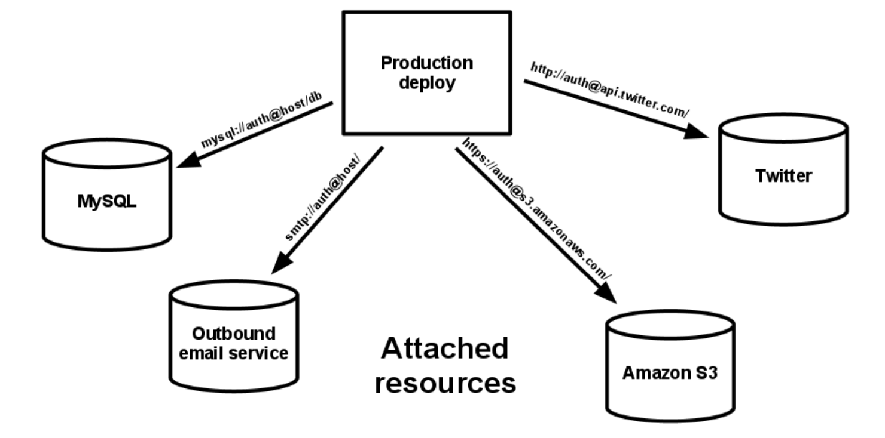
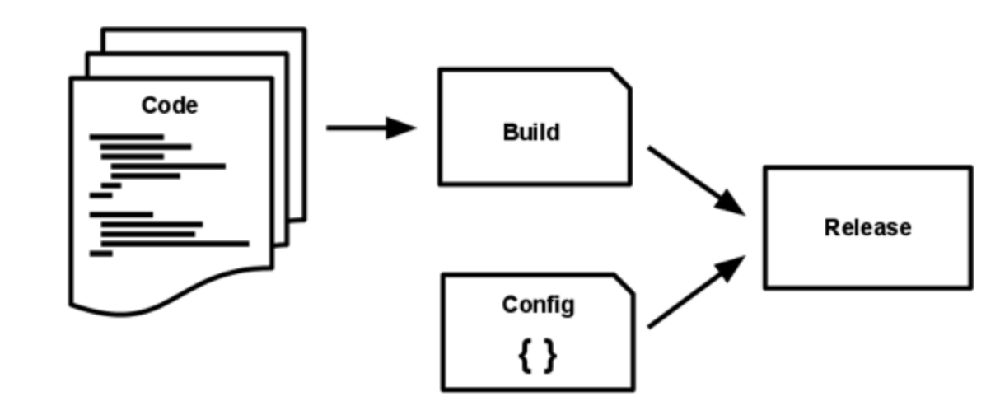
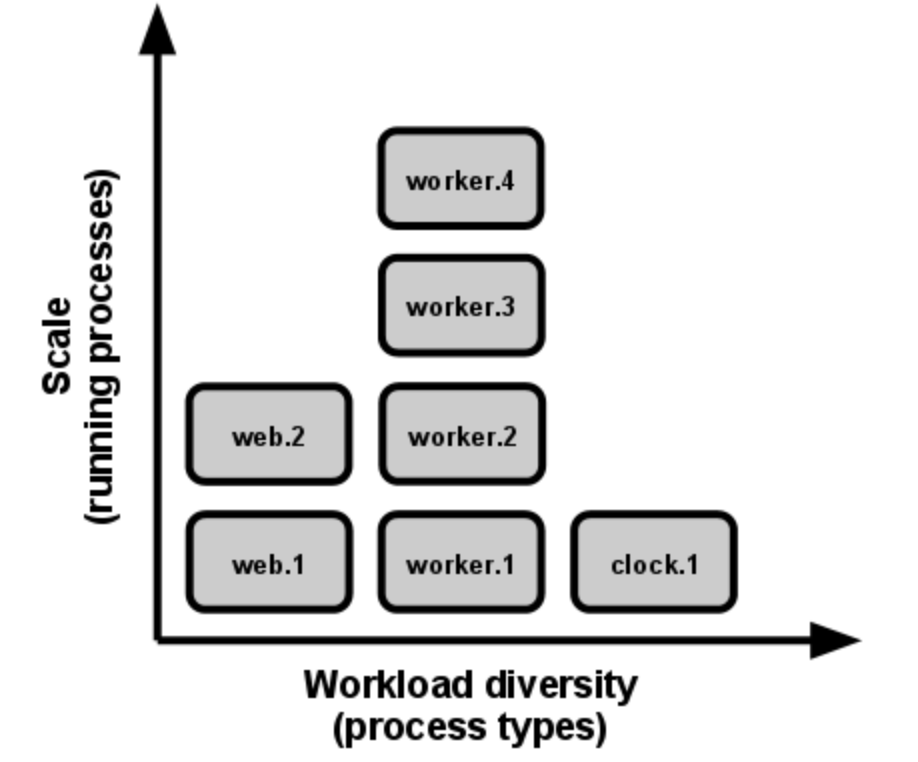

# Twelve Factor App

Software is delivered as a service a.k.a `web apps`. The [twelve factor app](https://12factor.net/) is a methodology for building SaaS applications by:

- Minimizing time and cost for new developers joining the project by using **declarative** formats for **setup automation**.
- Offering **maximum portability** between execution environments. 
- Suitable for deployment on modern **cloud platforms**. 
- Enabling **continuous deployment** by minimizing divergence between development and production.
- Maintaining no change to architecture and tooling while **scaling up**.

## Codebase
> One codebase tracked in revision control, many deploys

The app should be tracked in version control system like `Git`. A copy of the revision tracking database is known as `code repo` and any single repo or any set of repos sharing a root commit is referred to as `codebase`. 

- *One codebase* per app and *multiple deploys* of the app are possible. A *deploy* is running instance of the app like prod, staging, local dev environments and so on.
- The codebase is the *same across all deploys*, although different versions may be active in each deploy. 
- Multiple codebases translates to *distributed system* (not an app). Each component in the system is an app.
- Multiple apps should not share the same code. Factor shared code into libraries. 

## Dependencies
> Explicitly declare and isolate dependencies

The app never relies on implicit existence of system-wide packages. It declares all dependencies via a *dependency declaration manifest* and uses a *dependency isolation* tool during execution to remain in a sandbox. Both must be used together.

In Ruby, 

- `Gemfile` is for dependency declaration
- `bundle exec` is for dependecy isolation

In Python,

- `Pip` is for dependency declaration
- `Virtualenv` is for dependecy isolation

## Config
> Store config in the environment

An app’s **config** is everything that is likely to vary between deploys that includes:
- `Resource handles` to the database and other backing services
- `Credentials` to external services such as Amazon S3 or Twitter
- `Per-deploy values` such as the canonical hostname for the deploy

One solution is to use config files which are not checked to version control. But, this is prone to error if checked in. 

`The twelve-factor app stores config in environment variables`

Sometimes, config can be grouped together to be used in different environments like *development*, *test*, etc. This does *not scale properly* in case new environments enter into the scenario. 

## Backing services
> Treat backing services as attached resources

A backing service is any service (like MySQL or queueing systems) the app consumes over the network as part of its normal operation. 

`The code for a twelve-factor app makes no distinction between local and third party services`

- The app's code should not be changed and be able to swap (URL) between locally managed DB system to a third-party managed DB server. The resource handle in the config should be changed without tweaking the code. 
- Resources can be attached or detached at will. 

## Build, release, run
> Strictly separate build and run stages

A codebase is transformed into a deploy through three stages:
- The `build` stage is a transform which converts a code repo into an executable bundle known as a build by fetching dependencies. 
- The `release` stage takes the build produced by the build stage and combines it with the deploy’s current config. 
- The `run` (runtime) stage runs the app in the execution environment by launching set of the app's processes. 

`The app must have strict separation between build, release and run stages`

Every release has a unique **Release ID** and can be rolled back to a previous working release in case of a failure. 

## Processes
> Execute the app as one or more stateless processes

Any data that needs to persist must be stored in a stateful backing service, typically a database. In a simple scenario, process is launched via CLI in developer's laptop. In a complex scenario, production deploy of a sophisticated app may use many process types.

`Twelve-factor processes are stateless and share-nothing`

- The twelve-factor app never assumes that anything cached in memory or on disk will be available on a future request or job. 
- Even when running only one process, a restart (triggered by code deploy, config change, or the execution environment relocating the process to a different physical location) will usually wipe out all local (e.g., memory and filesystem) state.

## Port binding
> Export services via port binding

Web apps are sometimes executed inside a webserver container. The app does not rely on runtime injection of a webserver into the execution environment to create a web-facing service. 

`The twelve-factor app is completely self-contained. It exports HTTP as a service by binding to a port, and listening to requests coming in on that port.`

- The port-binding approach means that one app can become the backing service for another app, by providing the URL to the backing app as a resource handle in the config for the consuming app.
- For example, `http://localhost:8000/` is a service URL to access the service exported by the app (mkdocs) after building and serving the app using `mkdocs serve`. 

## Concurrency
> Scale out via the process model

Processes take strong cues from unix process model for running service daemons.Using this model, the developer can architect their app to handle diverse workloads by assigning each type of work to a process type. For example, HTTP requests may be handled by a web process, and long-running background tasks handled by a worker process.

`In the twelve-factor app, processes are a first class citizen`

- The share-nothing, horizontally partitionable nature of twelve-factor app processes means that adding more concurrency is a simple and reliable operation. 
- The array of process types and number of processes of each type is known as the *process formation*.

## Disposability
> Maximize robustness with fast startup and graceful shutdown

`The app's processes (disposable) can be started or stopped at a moment's notice resulting in elastic scaling, fast config changes, rapid deployment of code and robustness of production deploys.`

- Processes should minimize startup time. This helps in scalability and agility of the release process. 
- Processes should shut down gracefully when SIGTERM is received.
- In case of hardware failure, processes should be robust against sudden death.

## Dev/prod parity
> Keep development, staging, and production as similar as possible

`The twelve-factor app is designed for continuous deployment by keeping the gap between development and production to a minimum`

|    Gap    |                  Issue                  |                   Continuous Deployment                  |
|:---------:|:---------------------------------------:|:--------------------------------------------------------:|
|    Time   |  Devs code taking weeks to go into prod |     Devs writing and deploying code in hours/minutes     |
| Personnel |      Devs write code and ops deploy     | Devs involved in deploying and watching behavior in prod |
|   Tools   | Dev and Ops teams using different tools |  Keep development and production as similar as possible  |

`The twelve-factor developer resists the urge to use different backing services between development and production`

- Lightweight local services are less compelling than they once were. 
- Modern backing services such as Memcached, PostgreSQL and RabbitMQ are not difficult to install and run thanks to modern packaging systems, such as Homebrew and apt-get.
- Declarative provisioning tools such as Chef and Puppet combined with light-weight virtual environments such as Docker and Vagrant allow developers to run local environments which closely approximate production environments.

## Logs
> Treat logs as event streams

Logs provide visibility into the behavior of a running app. Logs are the stream of aggregated, time-ordered events collected from the output streams of all running processes and backing services. 

`A twelve-factor app never concerns itself with routing or storage of its output stream`

- Each running process writes event stream to stdout. 
    - During local development, the developer will view this stream in the foreground of their terminal to observe the app’s behavior. 
    - In staging or production deploys, each process’ stream will be captured by the execution environment, collated together with all other streams from the app, and routed to one or more final destinations for viewing and long-term archival. 
- The stream can be sent to a log indexing and analysis system that can help in:
    - Finding specific events in the past
    - Large-scale graphing of trends
    - Active alerting as per user-defined heuristics

## Admin processes
> Run admin/management tasks as one-off processes

The process formation is the array of processes that are used to do the app’s normal operations. There is a need to do other maintenance tasks such as:
- Database migrations 
- Console to run arbitrary code
- Running one-time scripts committed into the app’s repo

`One-off admin processes should be run in an identical environment as the regular long-running processes of the app`

- Admin code must ship with application code to avoid synchronization issues. 
- The same dependency isolation techniques should be used on all process types.
    - A Python program using Virtualenv should use the vendored bin/python for running both the Tornado webserver and any manage.py admin processes.

